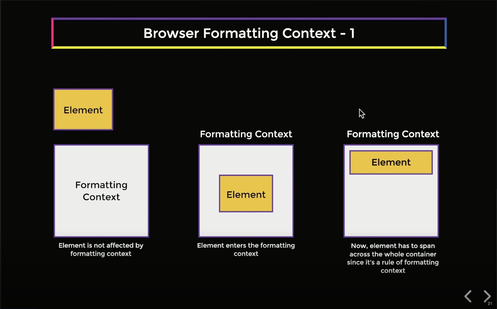
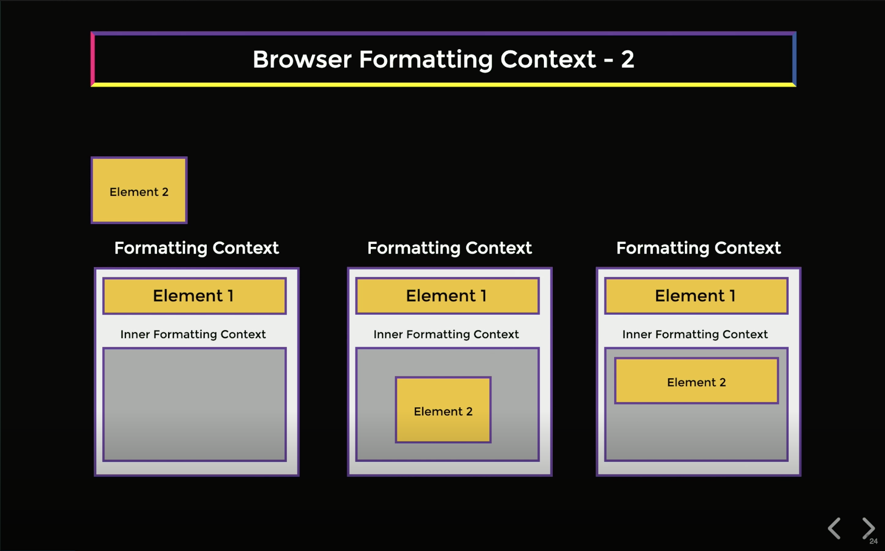
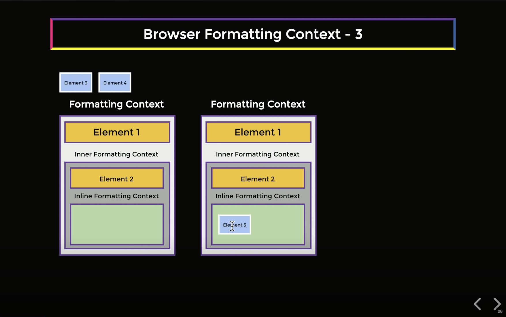
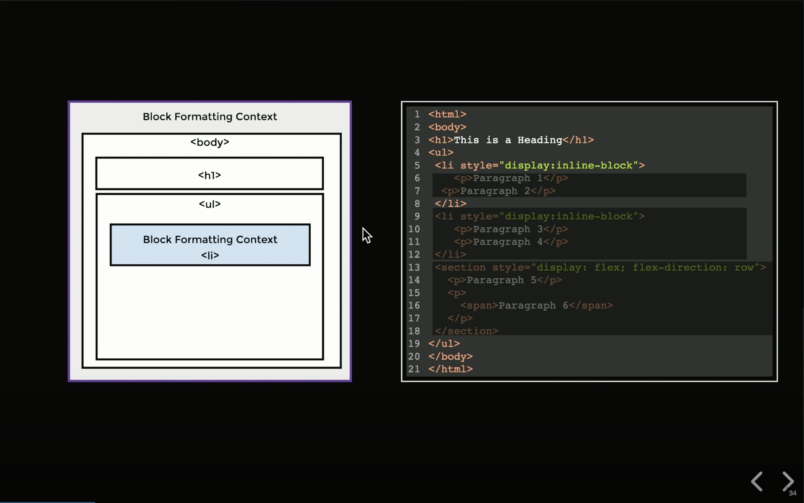
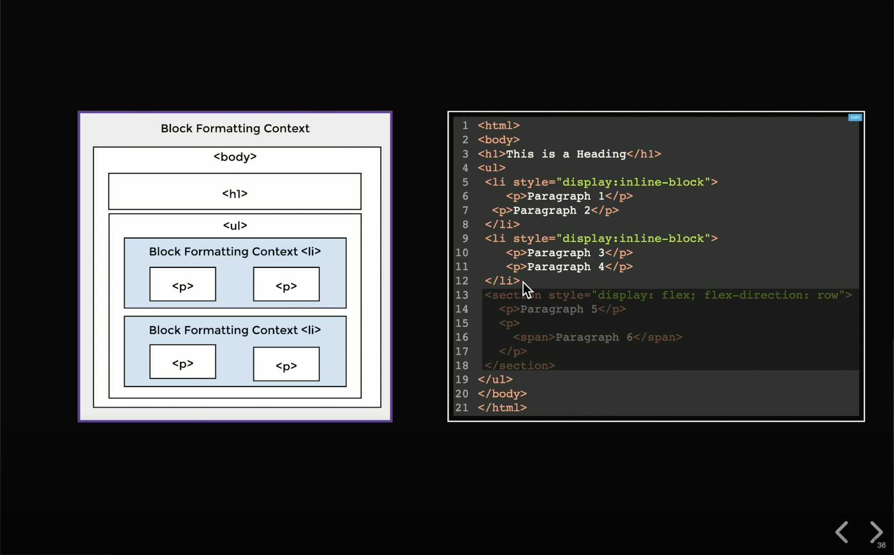
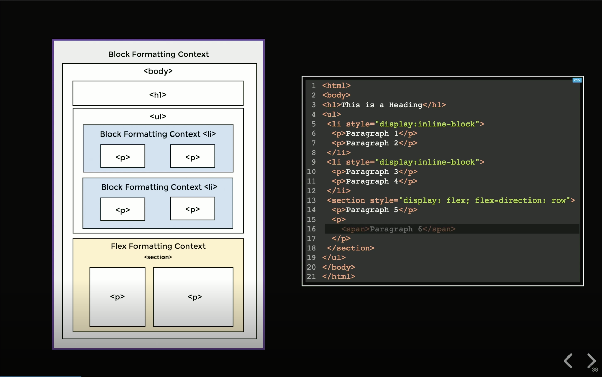
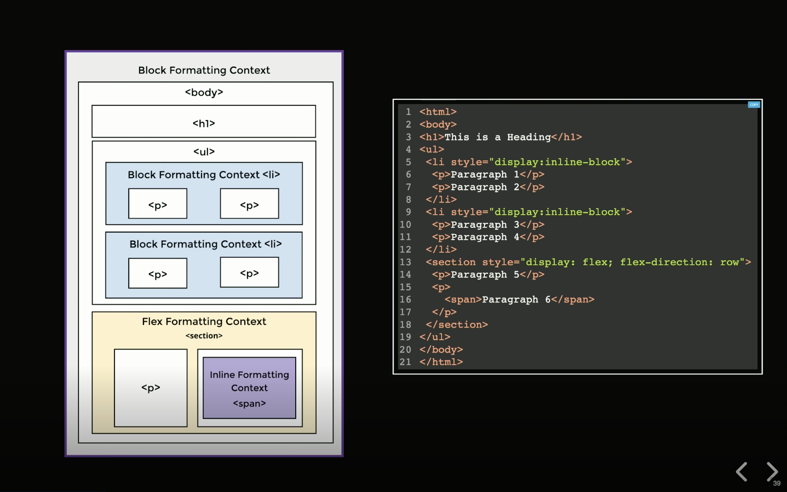

# Front-End System Design - 브라우저 서식 맥락(Browser Formatting Context)

## 1. 서식 맥락이란?

서식 맥락(Formatting Context)이란, 요소가 진입하면 특정 **규칙 집합**이 적용되는 일종의 **영역(Realm)**이다. 이 규칙들은 해당 영역 내 요소들의 크기, 배치, 렌더링 방향 등을 결정한다.

### CSS 스펙 정의

[CSS Display Module Level 3 스펙](https://www.w3.org/TR/css-display-3/#formatting-context)에서는 서식 맥락을 다음과 같이 정의한다:

> "A formatting context is the environment into which a set of related boxes are laid out. Different formatting contexts lay out their boxes according to different rules."
>
> (서식 맥락이란 관련된 박스들이 레이아웃되는 환경이다. 서로 다른 서식 맥락은 서로 다른 규칙에 따라 박스를 배치한다.)

- 박스는 새로운 독립적인 서식 맥락을 **생성(establish)**하거나, 포함 블록의 서식 맥락을 **계속(continue)**한다.
- 서식 맥락의 **유형**은 박스의 내부 디스플레이 타입(inner display type)에 의해 결정된다. (예: 그리드 컨테이너 → 그리드 서식 맥락, 플렉스 컨테이너 → 플렉스 서식 맥락, 블록 컨테이너 → 블록/인라인 서식 맥락)

---

## 2. 블록 서식 맥락(Block Formatting Context, BFC)

"이 영역에 들어간 요소는 **부모 너비의 100%를 차지**하고, **위에서 아래로 렌더링**된다"라는 규칙을 설정하면, 이는 곧 **블록 서식 맥락(BFC)**을 재현한 것이다.



### 중첩과 격리

서식 맥락 안에 또 다른 서식 맥락을 생성할 수 있다. 새로운 서식 맥락을 만들고 그 안에 요소를 배치하면, 동일한 규칙이 적용되어 해당 요소는 부모 컨테이너 너비의 100%를 차지한다.

핵심적인 차이점은 **내부 서식 맥락이 외부 서식 맥락과 완전히 격리**된다는 것이다. 요소가 일단 특정 영역에 들어가면, **외부 맥락의 규칙에 영향을 받지 않는다.**



---

## 3. 인라인 서식 맥락(Inline Formatting Context)

블록 서식 맥락과 다른 유형의 서식 맥락도 존재한다. **인라인 서식 맥락**에 진입한 요소는 다음과 같은 규칙을 따른다:

- **왼쪽에서 오른쪽**으로 렌더링된다.
- 포함하는 **콘텐츠의 너비만큼만** 차지한다.
- 전체 너비를 차지하지 않으므로, 여러 요소가 **한 줄에 나란히** 렌더링된다.



---

## 4. 서식 맥락의 핵심 개념

| 개념 | 설명 |
|------|------|
| **격리성(Isolation)** | 맥락 내의 요소들은 외부 맥락의 규칙으로부터 차폐된다. |
| **확장성(Scalability)** | CSS 스펙에 새로운 규칙 집합을 도입할 때 새로운 맥락을 생성한다. (예: `flex`, `grid`) |
| **예측 가능성(Predictability)** | 엄격한 규칙 집합이 있으므로 요소의 위치와 배치를 항상 예측할 수 있다. |

---

## 5. HTML 파싱과 서식 맥락 생성 과정

브라우저가 HTML 페이지를 한 줄씩 읽으며 서식 맥락을 생성하는 과정은 다음과 같다.

### 5.1 기본 동작

- **`<html>`** 태그는 페이지 시작 시 항상 새로운 **블록 서식 맥락(BFC)**을 생성한다.
- **`<body>`**, **`<h1>`~`<h6>`**, **`<ol>`** 등 특별한 `display` 속성이 지정되지 않은 요소는 기존 서식 맥락에 **진입만** 하고, 새로운 맥락을 생성하지 않는다.



### 5.2 새로운 서식 맥락 생성

요소에 새로운 서식 맥락을 생성하는 `display` 값(`inline-block`, `flex`, `grid` 등)이 설정되어 있으면, 브라우저는 해당 요소 내부에 새로운 서식 맥락을 생성한다. 

- **`display: inline-block`** → 블록 서식 맥락(BFC)의 특수한 경우. "인라인 블록 서식 맥락"이라는 별도의 맥락은 존재하지 않으며, 내부적으로는 BFC 규칙을 따른다. 해당 맥락 안에 배치되는 모든 요소는 인라인 블록 항목으로 렌더링된다.



> **참고:** 위 이미지에서 `<li>`가 가로 전체를 차지하는 것처럼 보이지만, 실제로 `inline-block` 요소 자체는 콘텐츠 크기만큼만 너비를 차지한다(shrink-to-fit). 이미지는 `<li>` 내부에 BFC가 생성된다는 구조적 관계를 보여주기 위한 도식이며, 실제 레이아웃 크기를 정확히 반영하지는 않는다. 또한 `<p>` 태그가 나란히 그려져 있지만, `<p>`는 `display: block`이 기본값이므로 BFC 규칙에 따라 실제로는 위→아래로 쌓인다.

- **`display: flex`** → **플렉스 서식 맥락(Flex Formatting Context)**이 생성되어, 모든 자식 항목이 플렉스 아이템이 된다.



> **참고:** 이미지의 코드에서 `<section>`은 `<ul>` 내부(4~19번 줄)에 위치하지만, 도식에서는 `<ul>`과 같은 레벨에 그려져 있다. 실제로는 `<ul>` 안에 중첩되어야 한다.

- **`<span>`** 등 인라인 요소 → **인라인 서식 맥락(Inline Formatting Context)**을 생성하며, 내부에 배치되는 모든 것이 인라인 콘텐츠가 된다.



---

## Q&A

<details>
<summary>Q: 서식 맥락은 HTML 태그가 설정하는 것인가, CSS가 설정하는 것인가?</summary>

서식 맥락은 **CSS에 의해 결정**된다. HTML 페이지를 시작하면 기본적으로 블록 서식 맥락(BFC)이 설정되지만, HTML 요소에 CSS 스타일을 설정하면 이를 재정의할 수 있다. 예를 들어 `display: flex`를 설정하면 플렉스 서식 맥락이 생성된다.

즉, **HTML 태그는 기본값을 제공**하고, **CSS가 이를 재정의**하여 최종적인 서식 맥락을 결정하는 구조이다.

</details>

<details>
<summary>Q: 새로운 서식 맥락을 생성하면 부모의 color 같은 CSS 속성도 격리되는가?</summary>

아니다. 서식 맥락의 격리는 **레이아웃 규칙**(크기, 배치, 방향)에만 적용된다. `color`, `font-size`, `line-height` 등 **상속 가능한(inherited) CSS 속성**은 DOM 트리를 따라 그대로 상속되며, 서식 맥락의 경계와 무관하다.

즉, 서식 맥락이 격리하는 것은 "요소가 어떻게 **배치**되는가"이지, "요소가 어떻게 **보이는가**"(색상, 폰트 등)가 아니다.

</details>

<details>
<summary>Q: display 속성 값에 따른 서식 맥락 생성 여부는?</summary>

| `display` 값 | FC 생성 여부 | 설명 |
|---|---|---|
| `block` | X | 새로운 FC를 생성하지 않고 부모의 FC에 참여(continue) |
| `inline` | X | 새로운 FC를 생성하지 않고 부모의 FC에 참여(continue) |
| `inline-block` | O → BFC | 내부적으로 BFC 규칙 적용 |
| `flow-root` | O → BFC | BFC 생성을 위해 명시적으로 도입된 값 |
| `flex` / `inline-flex` | O → Flex FC | 자식이 플렉스 아이템이 됨 |
| `grid` / `inline-grid` | O → Grid FC | 자식이 그리드 아이템이 됨 |
| `table` / `inline-table` | O → Table FC | 테이블 서식 맥락 생성 |

`block`과 `inline`은 "나는 이런 유형의 요소다"라는 **자기 선언**이고, 나머지는 "내 안에 새로운 규칙 영역을 만들겠다"라는 **FC 생성 트리거**이다.

</details>

---

## Quiz

**Q1.** 다음 중 새로운 서식 맥락(FC)을 **생성하지 않는** `display` 값은?

a) `inline-block`\
b) `flex`\
c) `block`\
d) `grid`

<details>
<summary>정답 보기</summary>

**c) `block`** — `display: block`은 새로운 FC를 생성하지 않고, 부모의 FC에 참여(continue)한다.

</details>

---

**Q2.** 서식 맥락의 격리(Isolation)가 차단하는 것은?

a) `color`, `font-size` 등 시각적 속성의 상속\
b) 레이아웃 규칙 (크기, 배치, 방향)\
c) DOM 트리의 부모-자식 관계\
d) 모든 CSS 속성의 상속

<details>
<summary>정답 보기</summary>

**b) 레이아웃 규칙 (크기, 배치, 방향)** — `color`, `font-size` 등 상속 가능한 CSS 속성은 서식 맥락의 경계와 무관하게 DOM 트리를 따라 상속된다.

</details>

---

**Q3.** 다음 코드에서 `<p>` 태그들은 어떻게 배치되는가?

```html
<div style="display: inline-block;">
  <p>A</p>
  <p>B</p>
</div>
```

a) 가로로 나란히\
b) 세로로 쌓임 (위→아래)

<details>
<summary>정답 보기</summary>

**b) 세로로 쌓임 (위→아래)** — `inline-block`은 내부에 BFC를 생성하고, `<p>`는 `display: block`이 기본값이므로 BFC 규칙에 따라 위→아래로 쌓인다.

</details>

---

**Q4.** 위 Q3 코드에서 `<div>` 자체의 너비는?

a) 부모 너비의 100%\
b) 콘텐츠 크기만큼 (shrink-to-fit)

<details>
<summary>정답 보기</summary>

**b) 콘텐츠 크기만큼 (shrink-to-fit)** — `inline-block`의 외부 동작(outer display type)은 `inline`이므로 콘텐츠에 맞게 축소된다. 내부에 BFC를 생성하지만, 요소 자체는 인라인처럼 동작한다.

</details>

---

**Q5.** `<body>` 태그는 새로운 BFC를 생성하는가?

<details>
<summary>정답 보기</summary>

**아니다.** `<body>`는 특별한 `display` 속성이 없으므로(`display: block` 기본값) 새로운 FC를 생성하지 않고, `<html>`이 생성한 BFC에 참여(continue)할 뿐이다.

</details>
