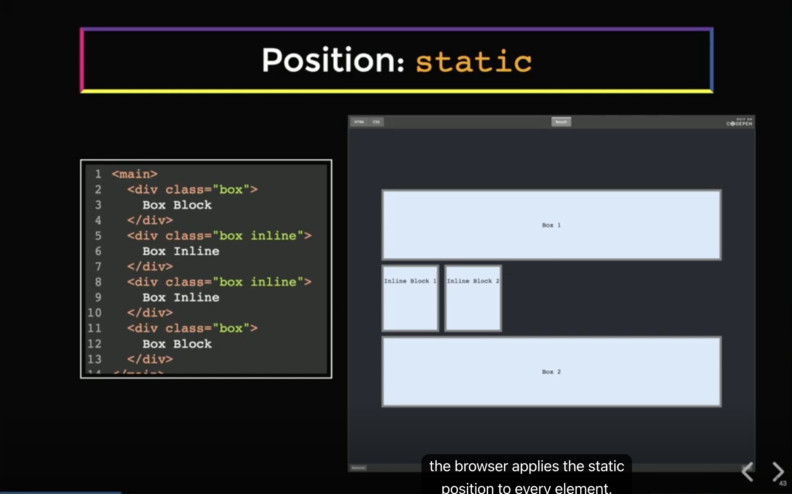
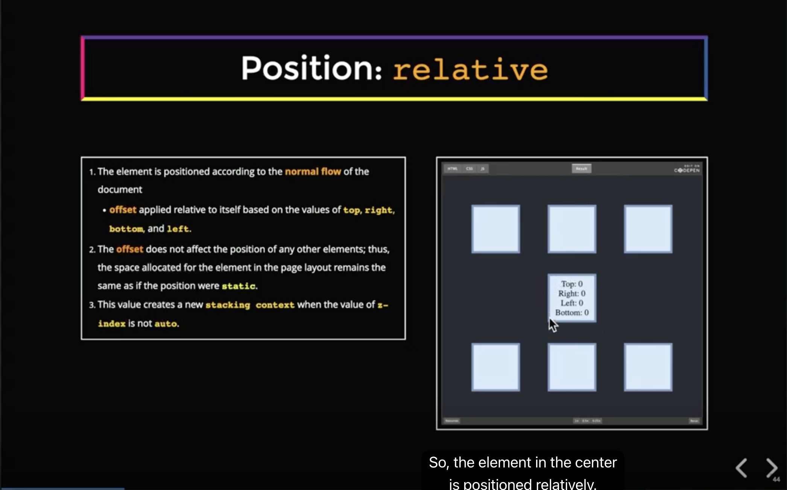
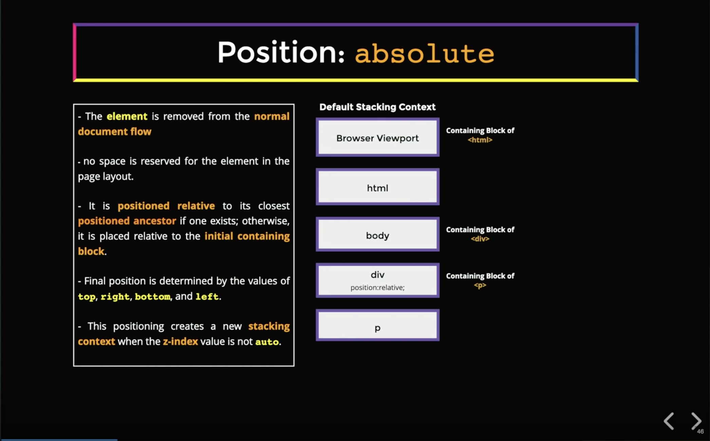
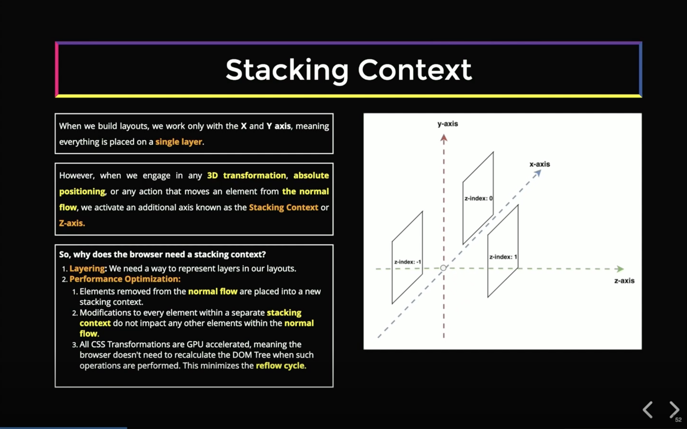

# Front-End System Design - Browser Positioning System

## 1. 일반 흐름(Normal Flow)

**일반 흐름(Normal Flow)**은 CSS 용어로, `position`이나 `float` 같은 특별한 속성 없이 브라우저가 요소를 기본 규칙대로 배치하는 상태를 의미합니다.

배치 방향은 HTML `dir` 속성 또는 CSS `direction` 속성으로 지정합니다.

- **LTR(Left-to-Right)** (`dir="ltr"`, 기본값): 브라우저가 위에서 아래로, 왼쪽에서 오른쪽으로 요소를 배치
- **RTL(Right-to-Left)** (`dir="rtl"`): 브라우저가 위에서 아래로, 오른쪽에서 왼쪽으로 요소를 배치

이 챕터의 핵심은 **`position` 속성을 사용하면 요소를 일반 흐름에서 제거할 수 있다**는 점입니다.

---

## 2. position 속성 값 비교

| 값         | 일반 흐름 유지    | 위치 지정 기준              | 쌓임 맥락 생성                  |
| ---------- | ----------------- | --------------------------- | ------------------------------- |
| `static`   | O (기본값)        | 없음                        | X                               |
| `relative` | O (공간 유지)     | 자기 자신의 원래 위치       | z-index가 auto가 아닐 때만 생성 |
| `absolute` | X (흐름에서 제거) | 포함 블록(Containing Block) | z-index가 auto가 아닐 때만 생성 |

---

## 3. 포함 블록(Containing Block)

포함 블록(Containing Block)은 **요소가 자신의 위치와 크기를 계산할 때 기준으로 삼는 조상 요소**입니다. 모든 요소는 포함 블록을 가지며, `position` 값에 따라 어떤 조상이 포함 블록이 되는지가 달라집니다.

| position 값          | 포함 블록                                                                       |
| -------------------- | ------------------------------------------------------------------------------- |
| `static`, `relative` | 가장 가까운 블록 조상 또는 flex/grid 컨테이너 (`display: inline` 요소는 건너뜀) |
| `absolute`           | 가장 가까운 `position: static`이 아닌 블록 조상 또는 flex/grid 컨테이너         |
| `fixed`              | 뷰포트                                                                          |

### static/relative: 가장 가까운 블록 조상

조상의 `position` 값과 무관하게 가장 가까운 블록 조상이 포함 블록이 됩니다.

```html
<body>
  <!-- body가 div의 포함 블록 -->
  <div>
    <!-- div가 p의 포함 블록 (position 값 무관) -->
    <p></p>
  </div>
</body>
```

### absolute: position: static이 아닌 가장 가까운 조상

`static`인 조상은 건너뛰고, `position`이 지정된 조상을 찾아 올라갑니다.

```html
<body>
  <div style="position: relative">
    <!-- static이 아님 → 포함 블록 -->
    <div>
      <!-- static → 건너뜀 -->
      <p style="position: absolute"></p>
    </div>
  </div>
</body>
```

> `relative`가 자식 `absolute`의 포함 블록 역할을 하는 패턴이 실무에서 가장 자주 쓰입니다.

---

## 4. position: static

`position: static`은 **모든 요소에 기본으로 적용**되는 값입니다. 브라우저는 레이아웃을 구성할 때 별도 지정이 없으면 모든 요소에 `static`을 적용하며, 요소들은 일반 흐름(Normal Flow)에 따라 위에서 아래로, 왼쪽에서 오른쪽으로 렌더링됩니다.

```css
/* 기본값 — 명시적으로 선언하지 않아도 동일하게 동작 */
div {
  position: static;
}
```

<!--  -->

---

## 5. position: relative

`position: relative`의 핵심 특성은 다음과 같습니다.

1. **브라우저는 요소를 일반 흐름(Normal Flow)과 동일하게 렌더링**합니다. 즉, 원래 공간을 유지합니다.
2. 최종 위치는 `top`, `right`, `bottom`, `left` 속성으로 조정합니다.
3. 위치를 이동시켜도 **다른 요소들에 영향을 미치지 않습니다.**
4. `z-index`를 `auto`가 아닌 값으로 지정하면 **새로운 쌓임 맥락(Stacking Context)**을 생성합니다.

```css
.element {
  position: relative;
  top: 20px;
  left: 30px;
}
```

요소가 일반 흐름에서 제거되기 때문에 위치 변경이 주변 요소에 영향을 주지 않습니다. `position: relative`를 적용하면 해당 요소를 기준으로 하는 새로운 쌓임 맥락(Stacking Context), 즉 격리된 독립 영역이 생성됩니다.

<!--  -->

---

## 6. position: absolute

`position: absolute`는 `relative`와 완전히 다르게 동작합니다.

1. **요소가 일반 흐름(Normal Flow)에서 완전히 제거**됩니다. 원래 공간이 사라집니다.
2. `z-index`를 `auto`가 아닌 값으로 지정하면 **새로운 쌓임 맥락(Stacking Context)**을 생성합니다.
3. 최종 위치는 `top`, `right`, `bottom`, `left` 속성으로 결정됩니다.
4. 기본적으로 포함 블록의 **좌측 상단 모서리**에 렌더링됩니다.

```css
.box {
  position: absolute;
  top: 0;
  left: 0;
}
```

### 예시: 복수의 absolute 요소 렌더링

```html
<section class="container">
  <div style="position: relative; height: 150px">
    <div class="box red" style="position: absolute">Box 1</div>
    <div class="box blue" style="position: absolute">Box 2</div>
  </div>
</section>
```

- Box 1과 Box 2는 모두 부모 `div`(`position: relative`)를 포함 블록으로 사용합니다.
- `z-index`를 지정하지 않으면 **나중에 렌더링된 요소(Box 2)가 위에** 표시됩니다.

<!--  -->

---

## 7. 쌓임 맥락(Stacking Context)과 Z축

브라우저는 항상 내부적으로 Z축을 관리합니다. 다만 일반 흐름(Normal Flow)만으로 레이아웃을 구성할 때는 Z축을 의식할 일이 없습니다. `position: absolute`나 3D 변환(3D Transformation) 등으로 Stacking Context를 생성하는 순간, **개발자가 Z축 레이어 순서를 명시적으로 관리해야 하는 상황**이 생깁니다.

```css
/* translate-z로 Z축 이동 */
.box {
  transform: translateZ(50px);
}

/* Z축 레이어 순서 명시 */
.box {
  position: absolute;
  z-index: 10;
}
```

- `z-index`를 지정하지 않으면 DOM 순서대로 스택됩니다 (나중 요소가 위).
- 각 쌓임 맥락(Stacking Context)은 **GPU 레이어**와 연결되며, 브라우저는 이를 독립적인 레이어로 처리합니다.

<!--  -->

---

## 8. relative/absolute 포지셔닝의 성능 이점

`relative`와 `absolute` 포지셔닝의 핵심 장점은 **요소를 일반 흐름(Normal Flow)에서 제거하여 격리(Isolation)를 달성**한다는 점입니다.

- 잠재적인 **리플로우(Reflow)**를 최소화할 수 있습니다. 리플로우는 Stacking Context가 아니라 **일반 흐름에서 제거되었기 때문**에 줄어드는 것입니다. 일반 흐름 안의 요소가 변하면 주변 요소 레이아웃까지 다시 계산해야 하지만, 흐름에서 제거된 요소는 주변에 영향을 주지 않습니다.
- Stacking Context로 격리된 요소는 변화가 생겨도 **해당 레이어만 다시 처리**하면 되므로 렌더링 성능이 향상됩니다.

### 이커머스에서의 실제 활용

성능 목적으로 `absolute`를 **의도적으로 선택**하는 경우는 실무에서 드뭅니다. 대부분의 사용 사례(툴팁, 모달, 배지, 찜 버튼 등)는 "다른 요소 위에 떠 있어야 하기 때문에" `absolute`를 쓰는 것이고, 성능 이점은 자연스럽게 따라오는 부수 효과입니다.

**결론: 이커머스에서 `relative/absolute`를 성능 목적으로 의도적으로 선택하는 경우는 사실상 없습니다.** 대부분은 "떠 있어야 하니까" 쓰는 것이고, 성능 이점은 부수 효과입니다.

예외적으로 **가상 스크롤(Virtual Scroll)**이 있습니다. 수천 개의 항목을 렌더링할 때 DOM 노드 수를 줄이기 위해 현재 뷰포트에 보이는 항목만 DOM에 유지하는 기법입니다. `absolute`는 항목을 추가/제거해도 다른 항목의 위치가 바뀌지 않도록 하기 위한 수단입니다.

```html
<div style="position: relative; height: 10000px">  <!-- 전체 높이를 미리 확보 -->
  <!-- 뷰포트에 보이는 항목만 존재, top 값으로 위치 직접 지정 -->
  <div style="position: absolute; top: 0px">항목 1</div>
  <div style="position: absolute; top: 300px">항목 2</div>
  <div style="position: absolute; top: 600px">항목 3</div>
</div>
```

- 스크롤 위치에 따라 보여야 할 항목의 `top` 값을 계산해 DOM에 추가/제거합니다.
- 항목이 추가/제거되어도 `absolute`이므로 다른 항목의 리플로우가 발생하지 않습니다.
- 가상 스크롤의 핵심 목적은 리플로우 방지보다 **DOM 노드 수를 줄여 메모리와 렌더링 비용을 낮추는 것**입니다.

**`absolute`가 필요한 이유 — 제거된 항목의 공간 유지**

DOM에서 항목을 제거하더라도 스크롤바가 정상 동작하려면 전체 높이가 유지되어야 합니다. `static`이면 항목을 제거하는 순간 스크롤 높이가 줄어들어 스크롤바가 튀고 위치가 어긋납니다. `absolute`로 각 항목의 `top`을 직접 지정하고 부모의 전체 높이를 유지하기 때문에, 항목이 DOM에 없어도 스크롤바가 정상적으로 동작합니다.

```
항목 1~10   제거됨 → 부모 높이로 공간 유지
항목 11~30  뷰포트에 보임 (overscan 포함 실제 렌더링)
항목 31~300 제거됨 → 부모 높이로 공간 유지
```

Virtuoso, React Window, React Virtual 등의 라이브러리가 이 방식을 사용하며, TanStack Infinite Query와 조합하면 무한 스크롤 + 가상 스크롤을 함께 구현할 수 있습니다.

<details>
<summary>쌓임 맥락(Stacking Context)과 GPU 레이어 연결 (추후 내용)</summary>

쌓임 맥락(Stacking Context)이 GPU 및 브라우저의 레이어 활용 방식과 어떻게 연결되는지는 이후 섹션에서 다룹니다. 현재 단계에서는 쌓임 맥락(Stacking Context)이 **레이어링 시스템**과 **요소들의 격리된 영역**을 제공한다는 것을 이해하는 것으로 충분합니다.

</details>

---

## Q&A

<details>
<summary>Stacking Context는 CSS 개념인가요?</summary>

네, CSS 명세에서 정의된 개념입니다. 브라우저가 요소들을 Z축 방향으로 어떤 순서로 그릴지 결정하는 독립된 렌더링 레이어 단위입니다. `position`, `opacity`, `transform` 등 특정 CSS 속성을 적용하면 새로운 Stacking Context가 생성됩니다.

</details>

<details>
<summary>absolute 자식에 z-index를 부여해 Stacking Context가 생겨도 위치에는 영향이 없나요?</summary>

네, 위치에는 전혀 영향이 없습니다. Stacking Context와 위치 계산은 완전히 별개입니다. `absolute` 요소의 위치는 항상 포함 블록(Containing Block) 기준으로 계산되고, `z-index`는 오직 Z축 레이어 순서에만 영향을 줍니다.

</details>

<details>
<summary>모든 HTML 요소가 기본으로 Stacking Context를 갖고 있나요?</summary>

아닙니다. 기본적으로 `<html>` 루트 요소만 Stacking Context를 가집니다. 나머지 요소들은 특정 CSS 조건을 만족할 때만 새로운 Stacking Context가 생성됩니다.

| 속성                          | 조건                         |
| ----------------------------- | ---------------------------- |
| `position: relative/absolute` | `z-index`가 `auto`가 아닐 때 |
| `position: fixed/sticky`      | 항상                         |
| `opacity`                     | 1 미만일 때                  |
| `transform`                   | `none`이 아닐 때             |

</details>

<details>
<summary>CSS 파일이 없으면 HTML에 Stacking Context가 없는 상태인가요?</summary>

아닙니다. CSS 파일 유무와 관계없이 `<html>` 루트 요소는 항상 Stacking Context를 가집니다. 브라우저가 기본 스타일(user agent stylesheet)을 통해 이를 부여하기 때문입니다. CSS 파일은 추가적인 Stacking Context를 생성하는 수단일 뿐입니다.

</details>

<details>
<summary>position: relative, absolute만 Stacking Context를 생성하나요?</summary>

아닙니다. `fixed`와 `sticky`도 생성합니다. 다만 생성 조건이 다릅니다.

| position 값            | Stacking Context 생성 조건   |
| ---------------------- | ---------------------------- |
| `static`               | 생성 안 함                   |
| `relative`, `absolute` | `z-index`가 `auto`가 아닐 때 |
| `fixed`, `sticky`      | 항상                         |

</details>

<details>
<summary>Stacking Context 생성 여부를 왜 알아야 하나요?</summary>

레이아웃을 의도한 대로 제어하기 위해서입니다. Stacking Context가 생성되면 그 안의 요소들은 외부와 완전히 격리된 독립 레이어가 됩니다.

대표적인 문제 상황은 `z-index`가 의도한 대로 동작하지 않는 경우입니다.

```html
<div style="position: relative; z-index: 1">
  <!-- Stacking Context A -->
  <div style="position: absolute; z-index: 9999"></div>
  <!-- A 안에 갇힘 -->
</div>

<div style="position: relative; z-index: 2">
  <!-- Stacking Context B -->
  <div style="position: absolute; z-index: 1"></div>
</div>
```

A 안의 요소가 `z-index: 9999`여도 B 안의 `z-index: 1` 요소보다 아래에 렌더링됩니다. **Stacking Context 간의 순서는 부모의 `z-index`로 결정**되기 때문입니다. `z-index`를 아무리 높여도 원하는 결과가 나오지 않을 때, Stacking Context가 어디서 생성되었는지 파악하는 것이 디버깅의 핵심입니다.

</details>

<details>
<summary>부모(position: relative)의 z-index가 자식(position: absolute)보다 높으면 부모가 위에 렌더링되나요?</summary>

아닙니다. 자식은 항상 부모 위에 렌더링됩니다. 브라우저는 항상 부모의 배경을 먼저 그리고 그 위에 자식을 그리는 것이 렌더링의 기본 원칙이기 때문입니다.

- 부모의 `z-index`는 **부모의 형제 요소들과의 순서**를 결정합니다.
- 자식의 `z-index`는 자식이 SC를 생성하지 않으면 부모와 같은 SC 안에서, SC를 생성하면 자식 SC 내부에서만 유효합니다.

어느 경우든 부모-자식 관계에서 `z-index`로 자식을 부모 아래로 내리는 것은 불가능합니다. 단, 자식에 `z-index: -1`을 주면 부모 배경 아래로 내려갈 수 있습니다.

</details>

<details>
<summary>translateZ와 z-index의 차이는 무엇인가요?</summary>

목적이 다릅니다.

|             | `z-index`            | `translateZ`                                |
| ----------- | -------------------- | ------------------------------------------- |
| 목적        | 레이어 **순서** 결정 | 3D 공간에서 **위치** 이동                   |
| 시각적 효과 | 앞/뒤 순서만 바뀜    | `perspective`가 있으면 크기도 변함 (원근감) |
| 주 용도     | 요소 겹침 순서 제어  | 3D 애니메이션, 원근감 효과                  |

`translateZ(양수값)`은 요소를 사용자 방향(화면 앞쪽)으로 이동시키며, 시각적으로 보이려면 부모에 `perspective` 속성이 필요합니다.

</details>

<details>
<summary>일반 웹페이지에서 translateZ를 쓰는 경우가 있나요?</summary>

`translateZ(0)`을 GPU 레이어 강제 생성 목적으로 사용하는 경우가 있습니다. Z축 이동이 목적이 아니라, `transform` 속성을 적용하면 브라우저가 해당 요소를 GPU 레이어로 올린다는 부수 효과를 이용하는 것입니다.

```css
.box {
  transform: translateZ(0); /* GPU 레이어로 올려 렌더링 성능 향상 */
}
```

이커머스에서는 이미지 캐러셀, 모달, 상품 카드 hover 효과 등 애니메이션이 버벅거릴 때 제한적으로 사용합니다. 다만 GPU 레이어는 메모리를 소비하므로 실제로 문제가 있는 요소에만 적용해야 합니다. 최근에는 `will-change: transform`으로 대체하는 추세입니다.

</details>

<details>
<summary>GPU 레이어란 무엇인가요?</summary>

브라우저는 화면을 그릴 때 CPU와 GPU를 모두 사용합니다.

- **CPU**: DOM 계산, 레이아웃, 페인트 등 일반적인 렌더링
- **GPU**: 이미 그려진 레이어들을 최종적으로 화면에 합치는 합성(Compositing) 작업

GPU 레이어는 특정 요소를 GPU가 독립적으로 처리하는 별도의 레이어입니다. 해당 요소에 변화가 생겨도 다른 요소를 다시 그리지 않고 GPU가 해당 레이어만 처리하기 때문에 애니메이션이 부드럽습니다. Stacking Context와 GPU 레이어의 연결은 이후 섹션에서 더 자세히 다룹니다.

</details>
