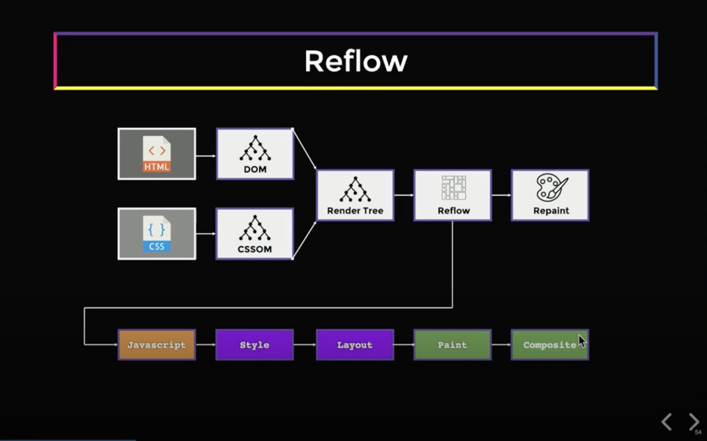
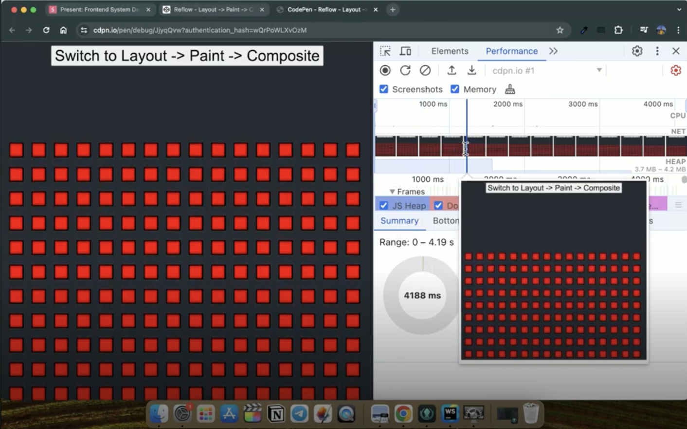
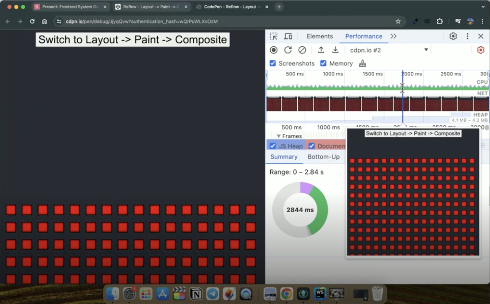
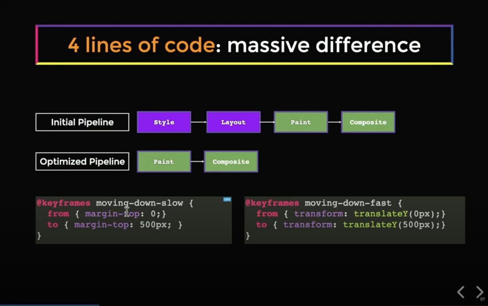

# Front-End System Design - Reflow

## 1. 리플로우(Reflow)란?

브라우저는 HTML과 CSS를 파싱하여 두 개의 트리(Tree)를 생성합니다.

- **DOM**: HTML을 객체(Object)로 표현한 트리
- **CSSOM(CSS Object Model)**: 특정 HTML 요소에 적용되는 모든 CSS 규칙의 트리

최종 **렌더 트리(Render Tree)**는 DOM과 CSSOM을 병합하여 만들어집니다.

**리플로우(Reflow)**는 **자바스크립트가 DOM 트리나 스타일을 수정할 때 발생하는 재계산 프로세스**입니다.

### 리플로우가 발생하는 대표적인 상황

- "더 보기(Load More)" 버튼을 눌러 리스트에 추가 카드를 렌더링할 때
- React 앱 렌더링 시, index HTML을 먼저 로드한 뒤 React가 DOM API를 통해 컨테이너(Container)에 DOM을 수정할 때

**Q. 초기 렌더링에서도 리플로우가 발생하나요?**

엄밀히 따지면 **"초기 렌더링은 리플로우가 아니다"에 더 가깝습니다.**

"**re-flow**"라는 단어 자체가 **"다시(re-) 흐르게 한다"**는 의미라, 한 번은 이미 흘러본 상태를 전제로 합니다. 즉:

- **초기 레이아웃(Initial Layout)**: 페이지 최초 로드 시의 첫 Layout 계산 → 보통 "리플로우"라고 부르지 **않습니다**
- **리플로우(Reflow)**: 초기 레이아웃 이후에 발생하는 **재계산**

강의의 Wikipedia 예시에서 "풀 리플로우를 수행한다"고 말한 부분은 **CSS 스타일시트가 뒤늦게 로드되어 이미 그려진 페이지를 다시 계산하는 상황**이므로 리플로우가 맞습니다.

---

## 2. 리플로우 파이프라인(Pipeline)

리플로우는 여러 단계로 구성된 **다단계 파이프라인(Multi-step Pipeline)**입니다.




| 단계                | 담당 리소스 | 설명                                          |
| ----------------- | ------ | ------------------------------------------- |
| **1. JavaScript** | CPU    | DOM/스타일 수정을 트리거                             |
| **2. Style**      | CPU    | 스타일 셀렉터(Selector) 컴파일 후 DOM/CSSOM 서브 트리 재구축 |
| **3. Layout**     | CPU    | 요소들의 위치와 HTML 속성을 재계산                       |
| **4. Paint**      | GPU    | 모니터에 픽셀(Pixel)을 그려 비트맵(Bitmap)으로 출력         |
| **5. Composite**  | GPU    | 여러 레이어(Layer)를 올바른 순서로 배열하여 최종 화면 구성        |


> **참고**: 위 단계 이름들은 특정 브라우저 엔진의 내부 모듈명이 아니라, 모든 렌더링 엔진이 공통으로 거치는 **표준 파이프라인 용어**입니다. Chrome DevTools의 Performance 탭에서도 `Recalculate Style`, `Layout`, `Paint`, `Composite Layers`처럼 동일한 이름으로 확인할 수 있습니다. 엔진별 실제 구현명은 다를 수 있습니다 (예: Firefox는 Layout을 `Reflow`, Paint를 `Display List Building`이라고 부릅니다).

### 각 단계의 특성

- **Style·Layout 단계는 CPU 바운드(CPU Bound)**: 리플로우를 너무 자주 트리거하면 렌더 스레드(Render Thread)가 블록(Block)될 수 있습니다.
- **Paint·Composite 단계는 GPU에서 수행**: CPU와 분리되어 렌더링 스레드를 블록하지 않으며, GPU는 픽셀을 그리는 데 매우 뛰어나기 때문에 빠릅니다.
- **Composite 단계**는 파이프라인의 마지막 단계로, 화면에 여러 레이어가 있을 때 이를 올바른 순서로 정렬해 올바르게 표시되도록 합니다.

---

## 3. Wikipedia 페이지 리플로우 예시

브라우저가 페이지를 렌더링할 때의 리플로우 흐름은 다음과 같습니다.

1. 먼저 HTML을 **위에서 아래로** 렌더링합니다.
2. 이후 CSS 스타일이 로드되면, 브라우저는 **페이지 전체에 대한 풀 리플로우(Full Reflow)**를 수행합니다.
3. 다시 위에서 아래로 진행하며 요소들의 스타일을 조정합니다.

Wikipedia 리플로우 렌더링

> **참고**: 이 예시는 **CSS 스타일시트가 늦게 로드되는 상황(FOUC)**을 가정합니다. 일반적인 React(CSR) 앱은 CSS가 `<head>`의 `<link>` 태그로 먼저 로드되므로 이 흐름과 다릅니다. 
---

## 4. 최적화 vs 비최적화 파이프라인 데모

**2,000개의 사각형을 화면에서 움직이는 예제**를 통해 두 파이프라인의 차이를 비교할 수 있습니다.

### 최적화 파이프라인(Optimized Pipeline)

- 주로 **GPU를 활용**합니다.
- 화면에 렉(Lag)이 없으며 **60fps**를 유지합니다.
- DevTools의 Performance 탭에서 측정 시 **CPU 사용률 0%** (평평한 선(Flat Line))로 나타납니다.

### 비최적화 파이프라인(Non-optimized Pipeline)

- **Style·Layout·Paint·Composite 모든 단계를 활용**합니다.
- Performance 스냅샷(Snapshot) 실행 시 **버퍼(Buffer)가 3초 만에 가득 찰 정도**로 CPU가 심하게 로드됩니다.
- 16코어 Mac에서는 그나마 동작하지만, 모든 기기가 고성능 CPU를 갖춘 것은 아닙니다. **CPU 스로틀링(Throttling)**을 적용하면, CPU가 단지 2,000개의 사각형을 움직이기 위해 매우 열심히 일하는 것을 확인할 수 있습니다.





---

## 5. 코드 차이: `margin-top` vs `translateY`

파이프라인의 차이는 때로 **코드 단 두 줄의 차이**에서 비롯됩니다.



### 비최적화: `margin-top` 애니메이션

```css
/* margin-top을 애니메이션 */
@keyframes move {
  from { margin-top: 0; }
  to   { margin-top: 100px; }
}
```

- 브라우저는 프레임마다 **2,000개 사각형 모두의 위치를 재계산**해야 합니다.
- **Layout 단계가 트리거**되어 CPU가 과부하됩니다.

### 최적화: `translateY` 애니메이션

```css
/* transform: translateY를 애니메이션 */
@keyframes move {
  from { transform: translateY(0); }
  to   { transform: translateY(100px); }
}
```

- **픽셀만 이동**시키며, 새로운 픽셀 세트(Pixel Set)를 그리기 위해 **GPU만 사용**합니다.
- **CSS 트랜스폼(CSS Transformation)은 CPU를 사용하지 않기 때문에** 훨씬 효율적입니다.

---

## 6. 핵심 요약

- **리플로우는 JavaScript의 DOM/스타일 수정으로 시작되는 다단계 프로세스**입니다.
- **Style·Layout은 CPU 바운드**이며, 리플로우를 자주 트리거하면 렌더 스레드가 블록됩니다.
- **Paint·Composite는 GPU에서 수행**되며, 렌더링 스레드와 분리되어 빠릅니다.
- **애니메이션은 `transform`, `opacity` 등 GPU 기반 속성을 사용**하여 Layout 단계를 건너뛰는 것이 성능에 유리합니다.
- 동일한 시각적 결과라도 **`margin-top`(Layout 재계산) vs `translateY`(픽셀 이동만)**처럼 구현 방식에 따라 CPU 부담이 크게 달라집니다.

---

## Q&A

<details>
<summary>Paint 단계의 "비트맵(Bitmap) 출력"은 어떤 과정이며, 리플로우에서만 일어나나요?</summary>

**비트맵**은 픽셀 색상 값의 2차원 배열로, 각 좌표 (x, y)에 어떤 색이 들어갈지 결정된 데이터입니다. GPU가 실제 모니터에 뿌리기 직전의 형태입니다.

예를 들어 4×3 크기의 빨간 사각형 비트맵은 다음과 같이 표현됩니다:

```
[
  [#FF0000, #FF0000, #FF0000, #FF0000],   // y=0 행
  [#FF0000, #FF0000, #FF0000, #FF0000],   // y=1 행
  [#FF0000, #FF0000, #FF0000, #FF0000],   // y=2 행
]
```

왼쪽 절반은 빨강, 오른쪽 절반은 파랑인 경우:

```
[
  [#FF0000, #FF0000, #0000FF, #0000FF],
  [#FF0000, #FF0000, #0000FF, #0000FF],
  [#FF0000, #FF0000, #0000FF, #0000FF],
]
```

실제 화면은 이런 2차원 배열이 수백만 픽셀 규모로 확장된 형태입니다 (예: 1920×1080 해상도면 약 207만 개의 픽셀 값).

**Paint 단계 = 래스터화(Rasterization)**: Layout까지는 "요소가 어디에, 얼마나 크게 있는가"만 결정된 벡터(수학적) 정보입니다. Paint는 이걸 실제 픽셀 색상으로 그리는 과정입니다.

- 배경색으로 직사각형 영역을 채움
- 모서리를 둥글게 깎기 (각 픽셀의 알파값 계산)
- 그림자를 가우시안 블러로 렌더링
- 텍스트 글리프(glyph)를 폰트 데이터에서 꺼내 픽셀로 그림
- 테두리, 이미지 등도 동일하게 픽셀화

**Paint·Composite는 초기 렌더링에서도 반드시 발생합니다.** 리플로우 전용 과정이 아닙니다.

| 상황 | 파이프라인 |
|------|-----------|
| 초기 렌더링 | HTML 파싱 + JS 실행 (DOM 구축) → CSSOM → Style → Layout → **Paint** → **Composite** |
| 리플로우 | JS → Style → Layout → **Paint** → **Composite** |

차이는:
- **초기 렌더링**: 전체 화면을 처음 페인트
- **리플로우**: 변경된 영역만 다시 페인트 (브라우저 최적화)

`transform: translateY`가 빠른 이유도 이와 연결됩니다. 이미 페인트된 비트맵(레이어)이 GPU 메모리에 존재하므로, `translateY`는 Paint를 스킵하고 Composite 단계만 실행합니다.

</details>

<details>
<summary>"렌더 스레드(Render Thread)"는 CPU에만 한정되는 개념인가요?</summary>

네, **"스레드(Thread)" 자체가 CPU 개념**입니다. GPU는 스레드가 아닌 수천 개의 코어로 대량 병렬 처리하는 다른 구조를 씁니다.

**브라우저의 주요 스레드 (모두 CPU에서 실행):**

| 스레드 | 담당 |
|--------|------|
| **Main Thread (=Render Thread)** | JS, Style, Layout, Paint 명령 생성 |
| Compositor Thread | 레이어 합성 명령 관리, 스크롤 처리 |
| Raster Thread | Paint 명령을 비트맵으로 변환 |
| GPU Thread | GPU에 명령 전달 (GPU를 조종하는 CPU 측 코드) |

GPU 자체는 스레드가 없지만, **CPU의 GPU 스레드**가 명령을 보내면 GPU 내부 코어들이 병렬 처리합니다.

**"렌더 스레드가 블록된다"는 표현의 의미:**
- 보통 좁은 의미로 **Main Thread(CPU)의 혼잡**을 가리킴
- 이 스레드가 JS + Style + Layout을 모두 처리하므로, Layout이 길어지면 JS 실행·스크롤·클릭 이벤트가 모두 밀립니다

</details>

<details>
<summary>Composite 단계에서 레이어가 분리되는 기준은 무엇인가요?</summary>

브라우저는 특정 조건을 만족하는 요소를 **별도의 컴포지터 레이어(Compositor Layer)**로 승격시킵니다. Chrome(Blink) 기준 대표적 조건은 다음과 같습니다.

- **3D Transform**: `translateZ(0)`, `translate3d(...)`, `rotateY(...)` 등 (2D transform은 승격 X)
- **`will-change` 속성**: `will-change: transform`, `will-change: opacity` — 브라우저에게 미리 분리 힌트
- **하드웨어 가속 요소**: `<video>`, `<canvas>`, `<iframe>`
- **애니메이션 진행 중인 속성**: `opacity`, `transform`의 CSS 애니메이션/트랜지션 실행 중
- **특정 CSS 속성**: `position: fixed` (일부 조건), `filter`, `backdrop-filter`, `mix-blend-mode`, `isolation: isolate`
- **오버플로우 스크롤 컨테이너** (브라우저 버전별 조건 상이)
- **루트 레이어**: `<html>`은 항상 루트 컴포지터 레이어

**확인 방법**: Chrome DevTools → `Cmd+Shift+P` → "Show Layers"로 레이어 구조와 승격 이유 확인 가능

**주의**: 레이어가 많아지면 GPU 메모리(VRAM) 점유가 늘고 Composite 비용이 증가하므로, `will-change`는 **필요한 요소에만, 애니메이션 시작 직전에만** 적용해야 합니다.

</details>

<details>
<summary>자주 변하는 요소를 독립 레이어로 분리하는 실무 예시는 무엇인가요?</summary>

**핵심 원칙**: 주변의 정적인 콘텐츠는 건드리지 않고 해당 요소만 GPU에서 빠르게 갱신하기 위해 레이어를 분리합니다.

**대표적인 실무 시나리오:**

- **고정 헤더·네비게이션** (`position: fixed`): 스크롤 시 헤더만 독립적으로 움직임
- **모달·드로어 애니메이션**: 슬라이드 중 뒤 본문 재페인트 방지
- **비디오 플레이어 / 캔버스**: `<video>`, `<canvas>`는 자동 승격 (매 프레임 변경)
- **캐러셀 / 슬라이더**: 슬라이드 트랙만 `transform`으로 이동
- **스크롤 기반 애니메이션 (Parallax)**: 스크롤마다 `translateY` 갱신
- **드래그 앤 드롭**: Trello 카드, Notion 블록 등 사용자가 끌어 옮기는 요소
- **토스트·알림 스택**: 연달아 등장·사라지는 알림
- **Floating Action Button (FAB)**: 화면 구석에 떠다니는 버튼

**적용 방법 예시:**
```css
.drawer {
  position: fixed;
  transform: translateX(-100%);
  transition: transform 0.3s;
  will-change: transform;
}
.drawer.open {
  transform: translateX(0);
}
```

**레이어 분리가 필요한지 판단하는 신호 (Chrome DevTools Performance 탭):**
- "Recalculate Style"이나 "Layout"이 애니메이션 중 반복 발생
- FPS 드롭 (60 → 30 이하)
- "Paint" 영역이 화면 전체로 번짐

이런 징후가 보이면 `will-change`나 `transform: translateZ(0)`으로 레이어 승격을 유도합니다.

</details>

<details>
<summary>fps는 무슨 단위이며, 웹에서 60fps가 기준인 이유는 무엇인가요?</summary>

**fps = Frames Per Second (초당 프레임 수)**. 화면이 1초 동안 몇 번 갱신되는지를 나타내는 단위입니다. "프레임(Frame)"은 화면에 그려지는 한 장의 정지 이미지로, 정지 이미지를 빠르게 연속으로 보여주어 움직임처럼 보이게 합니다.

**대표적인 fps 값:**

| fps | 의미 |
|-----|------|
| 24fps | 영화 표준 |
| 30fps | 부드러움의 최소선 |
| **60fps** | **웹의 표준 목표** |
| 120fps / 144fps | 고주사율 (게이밍 모니터, ProMotion) |

**웹에서 60fps가 기준인 이유:**

- 대부분의 모니터 주사율이 **60Hz**이므로, 브라우저도 60fps로 렌더링해야 끊김 없이 보입니다
- 60fps = **1 프레임당 약 16.67ms** (1000ms ÷ 60)

**프레임 버짓(Frame Budget):**

브라우저는 한 프레임 안(16.67ms)에 **JS → Style → Layout → Paint → Composite**를 모두 끝내야 합니다. 이 시간을 넘기면 **프레임 드롭(Frame Drop)**이 발생하여 화면이 끊겨 보입니다 (예: 20ms 걸리면 30fps로 떨어져 버벅임).

그래서 "최적화 파이프라인이 60fps 유지"의 의미는 **GPU만 사용하여 매 프레임을 16.67ms 안에 끝내서 부드럽게 보인다**는 뜻입니다.

</details>

<details>
<summary>`transform` 같은 GPU 경로도 GPU Bound 문제가 생기지 않나요?</summary>

**네, 실제로 존재합니다.** 다만 Composite 작업은 GPU에 매우 가벼운 편이라 대부분은 괜찮을 뿐입니다.

**GPU가 Composite에 강한 이유**: GPU는 수천 개의 작은 코어로 픽셀 단위 병렬 연산에 특화되어 있고, "비트맵을 이 위치에 / 이 알파값으로 블렌딩" 같은 단순 연산은 CPU의 Layout 계산보다 훨씬 효율적입니다.

**GPU Bound가 실제로 발생하는 시나리오:**

1. **VRAM 부족**: 레이어 하나당 비트맵 크기 = 가시 영역 × 4바이트(RGBA). 1920×1080 전체 화면 = 약 8MB. 모바일은 VRAM이 제한적
2. **모바일·저사양 GPU**: 16.67ms 프레임 버짓이 모바일에서는 훨씬 빡빡함
3. **너무 큰 레이어**: 4K에서 전체 화면 크기 요소 애니메이션 → GPU도 버거움
4. **과도한 오버드로(Overdraw)**: 반투명 레이어가 여러 겹 겹치면 같은 픽셀을 여러 번 계산
5. **복잡한 필터·블렌드**: `filter: blur()`, `backdrop-filter`는 GPU에서도 무거움

**증상**: 모바일 배터리 급소모, 발열로 thermal throttling, 저사양 기기에서 애니메이션 끊김

**그래도 "대체로 괜찮은" 이유:**
- **CPU는 공용 자원** (JS + 이벤트 + Style + Layout) → 막히면 앱 전체 멈춤
- **GPU는 렌더링 전용** → 막혀도 JS·이벤트는 계속 돌아감 (UX에 덜 치명적)
- 같은 과부하라도 **CPU Bound가 훨씬 치명적**

**실무 가이드:**
- `will-change`는 애니메이션 중인 요소에만, 끝나면 제거
- 전체 화면 크기의 요소에 `transform` 거는 건 주의
- 오버드로 최소화 (불필요한 반투명 중첩 지양)
- 모바일 테스트 필수
- `filter`, `backdrop-filter`는 작은 영역에만 신중히 사용

**결론**: "`transform`은 무조건 안전"은 아니지만, CPU Bound가 훨씬 흔하고 치명적이라 실무 우선순위는 여전히 "CPU → GPU 오프로드"가 맞습니다. 그 다음 세부 튜닝이 GPU 부담 관리입니다.

</details>

---

## Quiz

**Q1.** 리플로우 파이프라인의 5단계 중 **CPU 바운드(CPU Bound)**에 해당하는 단계로 묶인 것은?

a) JavaScript, Style, Layout\
b) Style, Layout, Paint\
c) Paint, Composite\
d) Layout, Paint, Composite

<details>
<summary>정답 보기</summary>

**a) JavaScript, Style, Layout** — JS 실행과 스타일 계산·레이아웃은 CPU에서 수행되며, Paint의 래스터화와 Composite는 주로 GPU에서 처리됩니다.

</details>

---

**Q2.** 다음 두 CSS 코드는 같은 시각적 결과를 만듭니다. 성능 관점에서 올바른 설명은?

```css
/* A */
@keyframes moveA {
  from { margin-top: 0; }
  to   { margin-top: 100px; }
}

/* B */
@keyframes moveB {
  from { transform: translateY(0); }
  to   { transform: translateY(100px); }
}
```

a) A와 B 모두 Layout 단계를 트리거한다\
b) A는 Layout을 트리거하지만 B는 Composite 단계만 실행한다\
c) B는 CPU를 전혀 사용하지 않으므로 무제한으로 써도 안전하다\
d) A는 GPU에서 실행되고 B는 CPU에서 실행된다

<details>
<summary>정답 보기</summary>

**b) A는 Layout을 트리거하지만 B는 Composite 단계만 실행한다** — `margin-top`은 위치·크기에 영향을 주므로 Layout을 재계산하고, `transform: translateY`는 이미 페인트된 비트맵을 GPU에서 이동시키므로 Composite만 실행됩니다.

</details>

---

**Q3.** 초기 렌더링과 리플로우의 차이로 가장 적절한 것은?

a) 초기 렌더링은 Paint·Composite를 실행하지 않는다\
b) 리플로우는 GPU를 전혀 사용하지 않는다\
c) 초기 렌더링은 전체 화면을 처음 페인트하고, 리플로우는 변경된 영역만 다시 페인트한다\
d) 초기 렌더링은 JavaScript가 전혀 개입할 수 없다

<details>
<summary>정답 보기</summary>

**c) 초기 렌더링은 전체 화면을 처음 페인트하고, 리플로우는 변경된 영역만 다시 페인트한다** — 두 경우 모두 Style → Layout → Paint → Composite 파이프라인을 거치지만, "re-flow"는 "이미 한 번 흘러본" 상태의 재계산을 의미합니다.

</details>

---

**Q4.** 다음 중 Composite 단계에서 **별도 레이어로 승격(Layer Promotion)**되는 조건이 **아닌** 것은?

a) `transform: translateZ(0)` 적용\
b) `will-change: transform` 선언\
c) `<video>` 또는 `<canvas>` 요소\
d) `margin: 10px` 적용

<details>
<summary>정답 보기</summary>

**d) `margin: 10px` 적용** — `margin`은 Layout에 영향을 줄 뿐 레이어 승격과는 무관합니다. 3D transform, `will-change`, 하드웨어 가속 요소, `position: fixed` 등이 레이어 승격의 대표적 조건입니다.

</details>

---

**Q5.** 60fps를 유지하기 위해 브라우저가 한 프레임 안에 처리해야 하는 시간 예산(Frame Budget)은?

a) 약 10ms\
b) 약 16.67ms\
c) 약 33.33ms\
d) 약 60ms

<details>
<summary>정답 보기</summary>

**b) 약 16.67ms** — 1000ms ÷ 60 = 16.67ms. 이 시간 안에 JS → Style → Layout → Paint → Composite를 모두 끝내야 프레임 드롭 없이 부드럽게 보입니다.

</details>

---

**Q6.** `transform`을 사용한 애니메이션이 GPU로 오프로드되지만, GPU Bound 문제가 발생할 수 있는 상황으로 가장 적절한 것은?

a) 데스크톱 Chrome에서 작은 요소 하나에 `translateX` 애니메이션을 적용하는 경우\
b) `will-change`를 모든 DOM 요소에 선언하고 큰 `filter: blur()`를 반투명 레이어에 중첩 적용한 경우\
c) `opacity`만 0에서 1로 바꾸는 페이드인 애니메이션\
d) 헤더 하나만 `position: fixed`로 고정한 경우

<details>
<summary>정답 보기</summary>

**b) `will-change`를 모든 DOM 요소에 선언하고 큰 `filter: blur()`를 반투명 레이어에 중첩 적용한 경우** — 과도한 레이어 생성(VRAM 소진), 큰 필터 연산, 오버드로(반투명 중첩)가 겹치면 GPU Bound가 발생할 수 있습니다.

</details>

