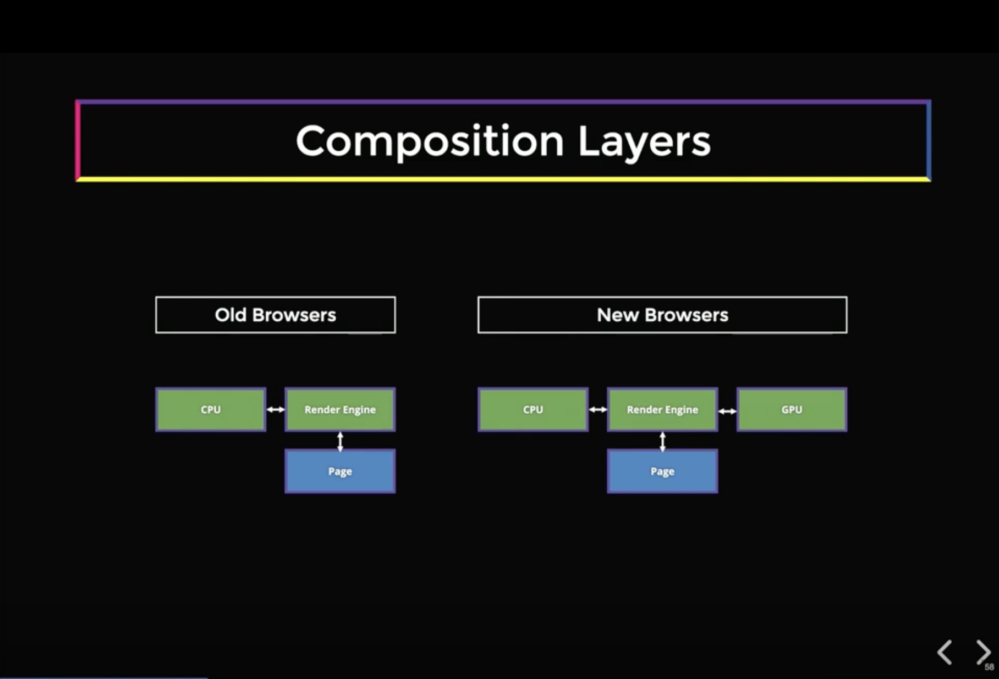
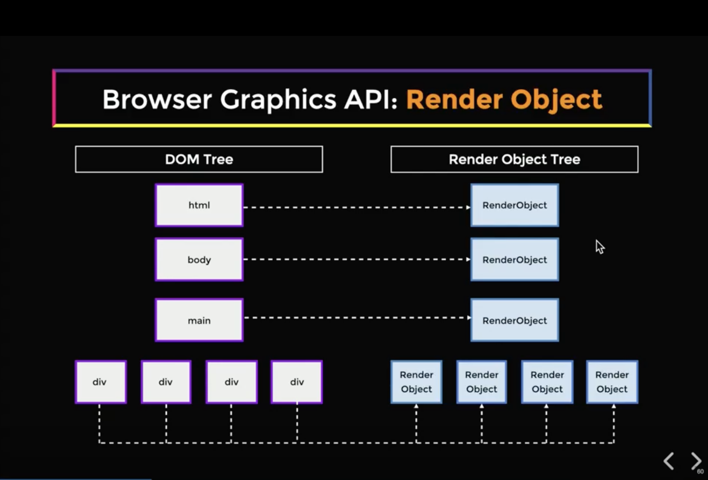
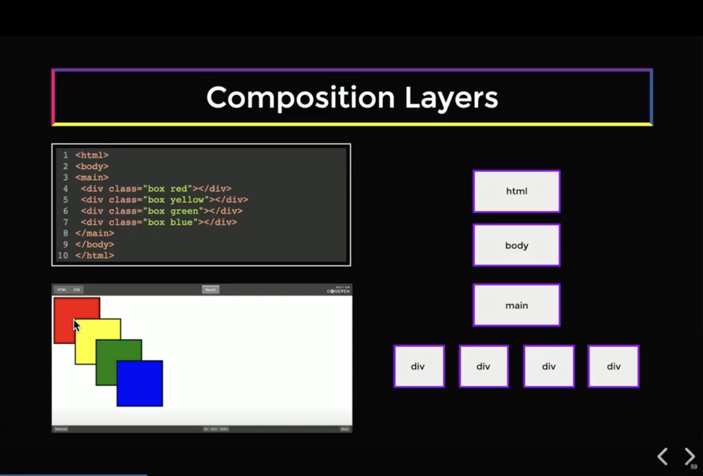
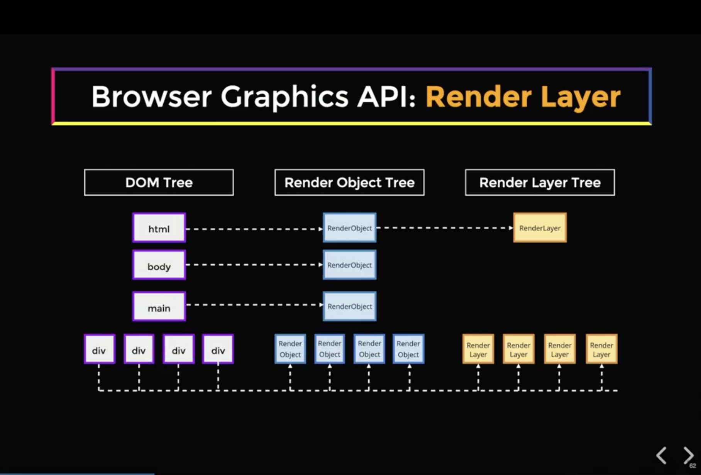
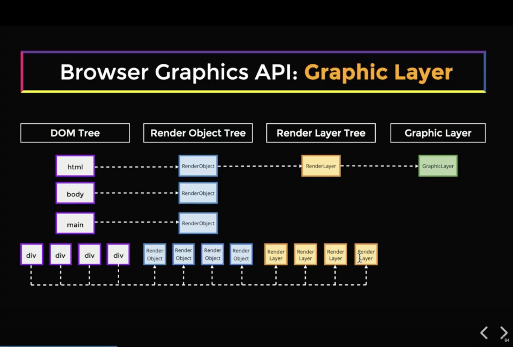
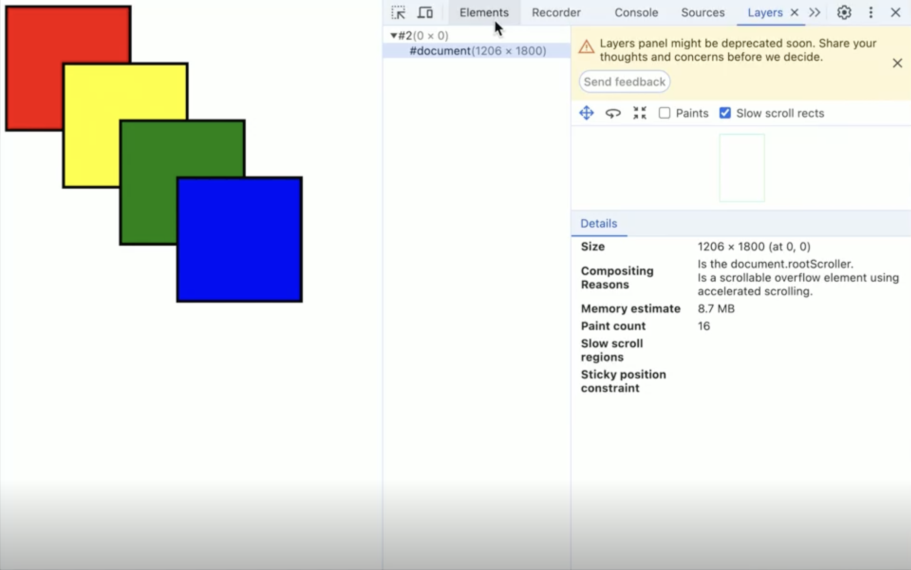

# Front-End System Design - Composition & Layers

## 1. CPU와 GPU의 역할 분담

예전 브라우저는 페이지 렌더링에 **CPU만** 사용했습니다. 최신 브라우저는 **CPU와 GPU를 병렬로 함께** 사용하여 렌더링을 최적화합니다.

브라우저가 GPU를 활용하려면 GPU를 인식하는 렌더링 트리 표현이 필요합니다. 이를 위해 브라우저는 **렌더 오브젝트 → 렌더 레이어 → 그래픽 레이어**로 이어지는 세 단계 트리 구조를 구성합니다(아래 2~4에서 차례로 설명).



---

## 2. 렌더 오브젝트 트리(Render Object Tree)

브라우저는 각 DOM 엘리먼트마다 하나의 **렌더 오브젝트(Render Object)**를 생성합니다. DOM 엘리먼트와의 관계는 **일대일(1:1) 대응**이지만, 두 가지는 완전히 다른 속성을 가집니다.



| 구분 | DOM 엘리먼트 | 렌더 오브젝트(Render Object) |
|------|-------------|---------------------------|
| 역할 | HTML 정보와 속성 전체를 담음 | 위에서 전달된 그래픽 컨텍스트를 사용해 비트맵에 엘리먼트를 그리는 방법을 앎 |
| 담고 있는 것 | HTML 속성, 이벤트, 구조 정보 | 그래픽 컨텍스트(Graphical Context) |
| 예시 형태 | `<div class="box">텍스트</div>` | `RenderBlock { width, height, paint(context) }` |

> **그래픽 컨텍스트(Graphical Context)란?** "지금 어떤 색·두께·위치로 그릴지"를 기억하는 상태판입니다. 프린터에 비유하면, <b>DOM 엘리먼트</b>는 "파란 배경, 100×50, 글자 '안녕'"이 적힌 <b>요구사항(주문서)</b>, <b>그래픽 컨텍스트</b>는 잉크 색·펜 두께 등을 기억하는 <b>프린터 설정 상태</b>, <b>렌더 오브젝트</b>는 그 상태를 바꿔가며 실제로 픽셀을 찍는 <b>작업자</b>입니다. 즉 그래픽 컨텍스트 자체는 그림이 아니라, 그리는 동안 계속 참조하고 바꾸는 설정 상태입니다. DOM은 정보만 가질 뿐 스스로 그리지 못하고, 렌더 오브젝트가 이 상태판을 거쳐야 화면에 그려집니다.

페이지에는 엘리먼트가 수백~수천 개 있을 수 있고, 렌더 오브젝트도 1:1로 그만큼 생깁니다. 만약 이 오브젝트 하나하나가 각자 따로 "내 픽셀은 내가 그릴게" 하고 GPU에 개별 요청을 보낸다면, GPU는 자잘한 작업 수천 개를 따로따로 처리해야 합니다. **GPU는 큰 덩어리를 한 번에 묶어 그릴 때 강력하고, 자잘한 것을 하나씩 그릴 때 비효율적**입니다. 그래서 렌더 오브젝트들을 그룹으로 묶어줄 상위 개념이 필요한데, 이것이 바로 **렌더 레이어(Render Layer)**입니다.

---

## 3. 렌더 레이어(Render Layer)

### 렌더 레이어가 생성되는 조건

- `position: relative` 또는 `position: absolute` 사용 시 → 스태킹 컨텍스트(Stacking Context)로 이동하여 새로운 레이어 생성
- **루트 엘리먼트**: 항상 루트 렌더 레이어가 필요
- Canvas, CSS 필터 등 **가속 컨텍스트(Accelerated Context)** 사용 시

### 렌더 레이어 구성 예시

아래와 같이 절대 위치로 지정된 네 개의 `div`가 있다고 가정합니다.

```html
<html>
  <body>
    <main>
      <div style="position: absolute;">Box 1</div>
      <div style="position: absolute;">Box 2</div>
      <div style="position: absolute;">Box 3</div>
      <div style="position: absolute;">Box 4</div>
    </main>
  </body>
</html>
```



| 엘리먼트 | 할당되는 렌더 레이어 |
|---------|------------------|
| `html` (루트) | 루트 렌더 레이어 생성 |
| `body`, `main` | 특별한 속성 없음 → 루트 렌더 레이어에 할당 |
| 4개의 `div` | 각각 `position: absolute`이므로 별도 렌더 레이어로 **승격(promote)** |



결과적으로 루트 렌더 레이어 1개 + 4개의 새로운 렌더 레이어 = 총 5개의 렌더 레이어가 생성됩니다. 각 렌더 레이어는 **자식(children) 속성**을 가지며, 렌더 레이어들을 **스택 순서의 연결 리스트(linked list)** 형태로 저장합니다. 마지막 레이어가 가장 먼저 렌더링됩니다.

### 5개 레이어에 적용한 구조

별도 레이어로 승격되지 않은 `body`, `main`은 루트 레이어가 직접 그리고, 승격된 div 4개가 루트의 <b>children</b>이 됩니다.

```
Root Render Layer  (html)
│   └ 직접 그리는 렌더 오브젝트: body, main
│
└─ children (스택 순서 연결 리스트)
       ┌───────────┐   ┌───────────┐   ┌───────────┐   ┌───────────┐
head → │ Box1 Layer│ → │ Box2 Layer│ → │ Box3 Layer│ → │ Box4 Layer│ → null
       └───────────┘   └───────────┘   └───────────┘   └───────────┘
```

- 루트 레이어 1개가 부모, div 레이어 4개가 자식이며 각자 `next` 포인터로 연결된 <b>연결 리스트</b>로 저장됩니다.

<b>렌더링(페인트) 순서</b> — "마지막 레이어가 가장 먼저 렌더링된다"를 적용하면:

| 순서 | 레이어 | 화면에서의 위치 |
|------|--------|----------------|
| 먼저 그림 | Box1 | 맨 <b>아래</b> 깔림 |
| ↓ | Box2 | |
| ↓ | Box3 | |
| 나중에 그림 | Box4 | 맨 <b>위</b>에 덮임 |

먼저 그려진 것이 바닥에 깔리고 나중에 그린 것이 그 위를 덮으므로, 소스 순서가 뒤인 Box4가 맨 위에 보입니다. 이렇게 리스트 순서를 곧 페인트 순서로 정렬해두면, 브라우저는 리스트를 한 번 훑으며 그리기만 해도 올바른 겹침(z-order)이 자동으로 완성됩니다.

수백 개의 렌더 레이어가 생기더라도, 그 수백 개의 렌더 레이어를 **각각 따로 GPU에 직접 올리는 것은 여전히 비효율적**입니다(GPU는 자잘한 단위를 하나씩 그리는 데 약함). 이 문제를 해결하는 것이 **그래픽 레이어(Graphic Layer)**입니다.

---

## 4. 그래픽 레이어(Graphic Layer)

**그래픽 레이어(Graphic Layer)**는 **3D 가속(3D Acceleration)**을 사용할 때 생성됩니다.

### 그래픽 레이어가 생성되는 조건

- `perspective` 등 원근감(Perspective) 변경 사용 시
- GPU 디코딩이 필요한 `<video>` 엘리먼트 사용 시
- `transform: translateZ(0)` 또는 `will-change` 등 3D 변환 적용 시

### 그래픽 레이어 구성 과정



1. 루트 렌더 레이어 → 첫 번째 그래픽 레이어 초기화 (페이지 로드 시 최소 1개는 항상 필요)
2. 나머지 렌더 레이어들은 3D 가속을 사용하지 않으므로 추가 그래픽 레이어 불필요
3. 결과적으로 모든 렌더 레이어가 **하나의 그래픽 레이어**에 적용됨

그래픽 레이어는 그래픽 컨텍스트를 가지고 렌더 레이어를 어떻게 그릴지 알고 있습니다. 이로써 브라우저 렌더링의 전체 사이클이 완성됩니다.

---

## 5. 렌더링 레이어 3단계 정리

| 레이어 | 목적 | 생성 조건 |
|--------|------|----------|
| 렌더 오브젝트(Render Object) | DOM 엘리먼트를 그래픽 컨텍스트로 그리는 방법을 정의 | DOM 엘리먼트마다 1:1 생성 |
| 렌더 레이어(Render Layer) | 스태킹 컨텍스트 단위로 엘리먼트를 그룹화 | `position`, 루트 엘리먼트, 가속 컨텍스트 |
| 그래픽 레이어(Graphic Layer) | GPU에서 실제로 렌더링되는 단위 | 3D 가속, perspective, video 등 |

---

## 6. 그래픽 레이어의 비용과 주의사항

### 데모 관찰 결과



- 기본 상태(그래픽 레이어 1개): **8.7MB** GPU 메모리 사용
- 4개의 박스에 3D 변환 적용 후: 총 5개의 그래픽 레이어
  - 기존 레이어: 여전히 8.7MB
  - **새로 생성된 각 레이어: 0.5MB 이상** 추가 가상 메모리 소비

초기 컨텍스트 초기화 비용은 항상 지불해야 하므로 기본 사용량은 거의 **상수(constant)**에 가깝습니다. 선형적으로 증가하지 않습니다.

### 과도한 레이어 승격의 위험성

수백 개의 엘리먼트를 그래픽 레이어로 승격시키면 즉시 **약 100MB~200MB의 GPU 메모리**를 소비할 수 있습니다.

> **VRAM(Video RAM)이란?** GPU에 달린 그래픽 전용 메모리입니다. 화면에 그릴 텍스처·레이어 등이 여기에 올라가야 GPU가 처리할 수 있습니다. 외장 GPU는 별도 VRAM 칩을 갖지만, 모바일·노트북의 내장 GPU는 별도 VRAM 없이 **시스템 RAM의 일부를 떼어 VRAM처럼 사용**합니다.

GPU 메모리(VRAM)는 브라우저 전용이 아니라 **시스템 전체(OS·다른 앱·OS의 화면 합성까지)에서 공유**됩니다. VRAM이 부족해지면 시스템이 **스왑 캐시(swap cache)**를 사용하게 되고, 이는 앱의 응답 불능(Unresponsive) 상태로 이어집니다. RAM도 시스템 공유 자원이지만, 용량이 크고 가상 메모리로 우아하게 스왑되며 프로세스별로 격리되는 반면, **VRAM은 용량이 작고 스왑 비용이 커서 과소비 시 시스템 전체가 곧장 영향을 받습니다.**

특히 **모바일 기기**는 고성능 GPU를 탑재하지 않으므로, 레이어 남용의 영향이 더욱 크게 나타납니다.

### 올바른 사용 가이드라인

| 상황 | 권장 여부 | 이유 |
|------|----------|------|
| 복잡한 애니메이션 위젯 | ✅ 권장 | GPU 최적화로 120FPS 확보 가능 |
| 정적 페이지의 모든 엘리먼트 | ❌ 비권장 | VRAM 낭비, 오히려 성능 저하 |
| 리스트 항목 전체 | ❌ 비권장 | 항목 수만큼 메모리 선형 증가 |

> **핵심 원칙**: 그래픽 레이어는 강력한 도구이지만, 잘못 사용하면 앱을 **최적화하는 것이 아니라 오히려 성능을 저하**시킬 수 있습니다.

---

## 7. CSS와 CPU 바운드 연산 피하기

리플로우(Reflow)를 최소화하는 것이 핵심 원칙입니다. **전체 렌더링 파이프라인을 트리거하지 않는 CSS 속성**만 변경하도록 노력해야 합니다.

참고 사이트: **[csstriggers.com](https://csstriggers.com)** — 특정 CSS 속성 변경 시 어떤 파이프라인(Layout, Paint, Composite)이 트리거되는지 확인 가능

---

## 8. CSS Transform vs Reflow

<details>
<summary>Q. CSS transform이 reflow보다 나은 최적화라고 들었습니다. transform도 GPU 메모리를 사용한다면 어떻게 이해해야 할까요?</summary>

**GPU를 사용하는 것이 CPU를 사용하는 것보다 항상 낫습니다.**

- CPU를 사용하면 **렌더링 스레드(Rendering Thread)가 차단**되어 응답성이 즉시 떨어집니다.
- GPU 때문에 앱이 응답 불능 상태가 되게 만들려면 상당한 노력이 필요합니다.
- 반면 CPU를 사용하면 몇 가지 실수만으로도 쉽게 **프레임 드롭(Frame Drop)**이 발생합니다.

따라서 GPU 메모리를 일부 소비하더라도 transform을 활용하는 것이 reflow를 유발하는 속성을 변경하는 것보다 훨씬 안전합니다.

</details>

---

## Q&A

<details>
<summary>Q. 8.7MB가 많은 수치 아닌가요? 적정 수치는 어느 정도인가요?</summary>

8.7MB는 상대적으로 작은 수치입니다. 일반적인 웹사이트는 수백 MB의 가상 메모리를 사용합니다. 초기 컨텍스트 초기화 비용은 항상 지불해야 하므로, 기본 사용량은 거의 상수(constant)에 가깝습니다. 레이어를 너무 많이 승격시키지 않는 한 문제가 되지 않습니다.

</details>

<details>
<summary>positioned 조상이 없는 absolute 요소는 <code>&lt;html&gt;</code> 엘리먼트를 기준(containing block)으로 삼나요?</summary>

엄밀히는 아닙니다. `<html>` 엘리먼트의 박스가 아니라 **초기 컨테이닝 블록(Initial Containing Block, ICB)**이 기준이 됩니다. ICB는 내용물과 무관하게 **항상 뷰포트(브라우저 화면) 크기**를 가진 사각형으로, 문서 최상단(0,0)에 고정됩니다.

`<html>` 박스와 ICB는 크기가 다를 수 있어 이 구분이 중요합니다.

- `<html>`의 높이는 내용물에 따라 결정됩니다(내용이 짧으면 짧음).
- ICB는 내용과 무관하게 항상 뷰포트 크기입니다.

예를 들어 absolute 요소에 `bottom: 0`을 주면 `<html>` 박스 바닥이 아니라 **뷰포트 바닥**에 붙습니다. 일상적으로 "html 기준"이라고 말하기도 하지만, `top`/`bottom` 동작을 정확히 이해하려면 **뷰포트 기준**으로 기억하는 것이 좋습니다.

</details>

<details>
<summary>렌더 오브젝트 / 렌더 레이어 / 그래픽 레이어는 각각 렌더링 파이프라인의 어느 시점에 생성되나요?</summary>

렌더링 파이프라인을 `1. DOM → 2. Style → 3. Layout → 4. Layer 정렬(z-order) → 5. Paint → 6. Composite`로 볼 때, 세 가지의 생성 시점은 다릅니다.

- <b>렌더 오브젝트</b> — 2~3 사이(Style 직후 렌더 오브젝트 트리 구축 시). DOM 엘리먼트마다 1:1 생성.
- <b>렌더 레이어</b> — 2~3 사이(Style 직후). 그 요소의 style만으로 필요 여부 판단 가능(`position`, `z-index` 등).
- <b>그래픽 레이어</b> — 5 이후 Composite 단계. 주변 레이어와의 겹침·페인트 결과·VRAM 비용까지 봐야 결정.

핵심은 <b>렌더 레이어는 style만 보면 필요 여부를 알 수 있어 앞쪽에서 생성</b>되지만, <b>그래픽 레이어는 GPU에 실제로 올릴지를 정하는 단위라 레이아웃·페인트가 끝나고 충분한 정보가 모인 맨 뒤에서 생성</b>된다는 점입니다. 최신 Blink는 "Composite After Paint" 방식이라 전체를 페인트한 뒤 그 결과를 보고 어떤 부분을 GPU 레이어로 승격할지 결정합니다.

</details>

<details>
<summary>VRAM이 시스템 공유 자원이라면, CPU 메모리(RAM)는 브라우저 전용인가요?</summary>

아닙니다. RAM도 브라우저 전용이 아니라 OS가 모든 프로세스에 나눠주는 시스템 공유 자원입니다. 다만 VRAM과 <b>공유 방식과 부족할 때의 대처가 다릅니다.</b>

- <b>용량</b>: RAM은 보통 큼(8~32GB+), VRAM은 상대적으로 작음(2~8GB).
- <b>부족할 때</b>: RAM은 가상 메모리로 디스크에 우아하게 스왑되고 OS가 성숙하게 관리합니다. VRAM은 스왑 비용이 크고 거칠게 동작해 곧장 버벅임으로 이어집니다.
- <b>격리</b>: RAM은 프로세스마다 독립된 가상 주소 공간으로 격리되어 서로 간섭하지 않습니다(브라우저는 탭마다 별도 프로세스를 쓰기도 함). VRAM은 프로세스 격리가 약하고 풀을 직접 나눠 씁니다.

즉 둘 다 시스템 공유 자원이지만, <b>RAM은 부족을 우아하게 견디는 반면 VRAM은 한 프로세스가 과소비하면 시스템 전체가 곧장 영향을 받습니다.</b> 그래서 노트가 RAM이 아니라 VRAM을 콕 집어 경고한 것입니다.

</details>
