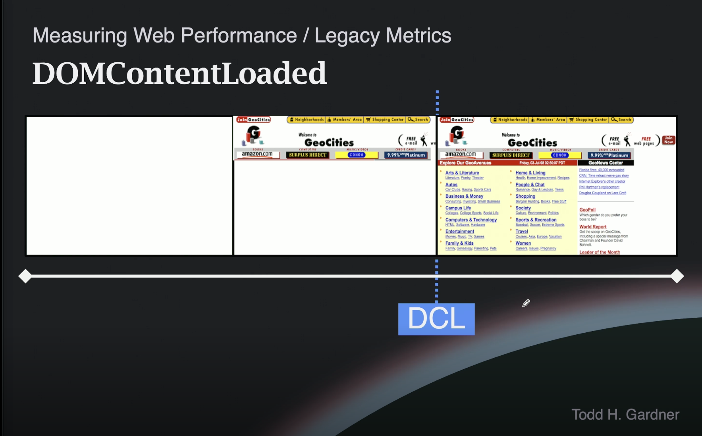

# Web Performance Fundamentals - Measuring DOMContentLoaded & Load Events

## 1. 레거시 지표란?

"레거시"라는 표현은 이 지표들이 사라진다는 의미가 아니라,
과거에 웹 성능을 측정할 때 주로 사용하던 지표라는 의미입니다.
현재는 예전만큼 많이 쓰이지 않지만, 여전히 이해하고 있어야 합니다.

구체적으로는 DOMContentLoaded, Load 이벤트가 **발화하는 시간(ms)** 을 성능 지표로 삼았습니다.

```
DOMContentLoaded 이벤트 발화 시점 → 1200ms  ← 이 숫자를 "성능 지표"로 사용
Load 이벤트 발화 시점             → 3400ms
```

그러나 이 시간이 짧아도 사용자가 실제로 느끼는 경험과 일치하지 않는 경우가 많았습니다. DOM은 완성됐지만 화면에 아무것도 안 보이거나, 버튼을 눌러도 반응이 없는 상황이 생겼기 때문입니다. 그래서 "사용자가 실제로 느끼는 경험"을 측정하는 **Core Web Vitals(LCP, INP, CLS 등)** 로 넘어가게 됐습니다.

## 2. DOMContentLoaded (DCL)

### 정의

HTML 파싱이 완료되어 **DOM 트리가 완성된 시점**에 브라우저가 발생시키는 **이벤트**.
구체적으로는 HTML이 완전히 다운로드·파싱되고, HTML 안에 포함된 모든 **스크립트(JavaScript)가 완전히 실행**된 상태에서 발화한다.

- ✅ 문서 내 모든 것이 완료된 시점
- ❌ 이미지는 아직 로드되지 않았을 수 있음

### 워터폴(Waterfall) 차트에서의 위치


> 파란 점선(DCL 마커)은 JavaScript 실행이 완료된 직후, 이미지 로드가 끝나기 전에 위치함

### 필름스트립(Filmstrip) 예시 — geocities.com



| 시점         | 상태                         |
| ------------ | ---------------------------- |
| 탐색 시작    | 빈 화면                      |
| 파싱 진행 중 | 콘텐츠 일부 렌더링           |
| **DCL 발생** | **구조 완성, 이미지 미완성** |
| DCL 이후     | 이미지 로드 완료             |

### 사용하는 이유

- 페이지의 모든 **DOM 요소에 접근 및 조작 가능**한 시점을 파악
- 이미지/미디어는 아직 표시되지 않았을 수 있음

### 코드 예시

```js
window.addEventListener("DOMContentLoaded", (event) => {
  console.log(event.timeStamp); // 예: 1807ms
});
```

## 3. Load Event

### 정의

HTML과 모든 **알려진(known) 리소스**가 다운로드되고 렌더링이 완료된 시점에 브라우저가 발생시키는 **이벤트**.
즉, 이미지를 포함한 모든 리소스가 페이지에 표시된 상태에서 발화한다.

### "알려진(known)"의 의미

| 경우                               | Load 이벤트와의 관계                |
| ---------------------------------- | ----------------------------------- |
| JavaScript로 동적 추가 (Load 이전) | Load 이벤트가 기다림                |
| JavaScript로 동적 추가 (Load 이후) | 이미 발생한 이후이므로 무관         |
| `loading="lazy"` 로 지정된 리소스  | Load 이벤트 이후에도 로드될 수 있음 |

### 워터폴(Waterfall) 차트에서의 위치


> 빨간 마커(Load)는 워터폴 차트의 가장 끝, 마지막 이미지가 완료된 지점에 위치

### 브라우저 동작

- 이 시점에 브라우저의 **로딩 스피너가 멈춤**
- 단, 실제로 페이지가 완전히 완료됐다는 의미는 아님 (JS 동적 작업 등이 계속될 수 있음)

### 사용하는 이유

- 초기 페이지 설정 이후의 **리포팅, 업데이트 작업 시작** 기점으로 활용
- 모든 초기 리소스가 준비된 후 JavaScript를 실행하고 싶을 때 래퍼로 사용
  (실행하려는 코드를 `load` 콜백 안에 감싸 실행 시점을 제어하는 패턴)

### 코드 예시

```js
window.addEventListener("load", (event) => {
  console.log(event.timeStamp); // Load 이벤트 발생 시점 (ms)
});
```

## 4. 두 지표 비교 요약

| 지표                 | 완료 조건                    | 이미지 포함 | 주요 용도                    |
| -------------------- | ---------------------------- | ----------- | ---------------------------- |
| **DOMContentLoaded** | HTML 파싱 + JS 실행 완료     | ❌          | DOM 접근 가능 시점 파악      |
| **Load**             | 모든 알려진 리소스 로드 완료 | ✅          | 페이지 초기화 완료 시점 파악 |

---

## Q&A

<details>
<summary>워터폴에서 HTML(파란색)과 JS(노란색)는 별개인데, DCL 정의에서 "HTML 안에 포함된 스크립트"는 무슨 의미인가요?</summary>

워터폴의 파란색(HTML)과 노란색(JS)은 **다운로드 단위로는 별개의 리소스**이지만, HTML 파싱 흐름 안에서 JS는 HTML의 `<script src="...">` 태그를 통해 실행이 지시되는 종속 작업입니다.

```
[🔵 HTML 파싱 중...]
  → <script src="app.js"> 발견
  → [🟡 JS 다운로드] → [JS 실행]
  → HTML 파싱 재개
[DOMContentLoaded 발생]
```

DCL이 JS 실행 완료를 기다리는 이유는, JS가 `document.write()` 등으로 DOM을 동적으로 변경할 수 있기 때문입니다. 브라우저는 JS 실행이 끝나기 전까지 DOM이 확정되지 않았다고 판단합니다.

| 관점                   | 파란색(HTML)과 노란색(JS)의 관계      |
| ---------------------- | ------------------------------------- |
| 워터폴 (다운로드 단위) | 별개의 리소스                         |
| HTML 파싱 흐름         | JS는 HTML의 지시로 실행되는 종속 작업 |
| DCL 기준               | 둘 다 완료되어야 발화                 |

따라서 "HTML 안에 포함된 스크립트"란 별도 파일이라도 **`<script>` 태그를 통해 HTML이 참조하는 모든 JS**를 의미합니다.

</details>

<details>
<summary>필름스트립에서 JS 로드가 끝나기 전에도 콘텐츠 일부가 렌더링되는 이유는 무엇인가요?</summary>

JS는 렌더링을 막는 것이 아니라 **HTML 파싱을 막습니다(파서 블로킹)**. CSS가 렌더를 막는 것과는 다릅니다.

| 리소스  | 블로킹 방식 | 영향                                             |
| ------- | ----------- | ------------------------------------------------ |
| **CSS** | 렌더 블로킹 | CSSOM 완성 전까지 화면에 아무것도 표시 안 됨     |
| **JS**  | 파서 블로킹 | `<script>` 태그를 만난 시점부터 HTML 파싱이 멈춤 |

`<script>` 태그를 만나기 **전**에 이미 파싱된 콘텐츠는 CSS만 준비되면 바로 렌더링됩니다.

```
[🔵 HTML 파싱]
  → <h1>제목</h1> 파싱 완료 → 렌더링 가능
  → <p>본문</p>   파싱 완료 → 렌더링 가능
  → <script src="app.js"> 발견 → ⏸ 파싱 멈춤
      [🟡 JS 다운로드 & 실행]
  → ▶ 파싱 재개
  →  발견 → 이미지 다운로드 시작
[DCL 발생]
```

Geocities 필름스트립에서 일부 콘텐츠가 보인 이유는, `<script>` 태그 이전에 파싱된 텍스트/구조가 CSS 로드 완료 후 즉시 화면에 표시됐기 때문입니다.

</details>

<details>
<summary>JS로 인해 HTML 파싱이 멈추고 재개되는 과정이 워터폴에는 어떻게 표시되나요?</summary>

워터폴은 **네트워크 요청(다운로드)만 표시**합니다. 파싱이나 JS 실행 같은 CPU 작업은 워터폴에 직접 나타나지 않습니다.

워터폴에서는 "JS 바 종료 → DCL 마커"라는 결과만 보입니다.

```
[🔵 HTML 다운로드]
                   [🟣 CSS 다운로드    ]
                   [🟡 JS 다운로드 & 실행]
                                          | DCL |
                                          [🟢 이미지 1]
                                          [🟢 이미지 2]
```

파싱이 어떻게 멈추고 재개됐는지 확인하려면 Chrome DevTools의 **Performance 탭 → Flame Chart**를 사용해야 합니다.

```
[Parse HTML ━━━━━]  [Parse HTML ━━━━━━]
                 [Evaluate Script ━━━]
                 ↑ JS 실행 중 파싱 멈춤
```

| 차트        | 볼 수 있는 것                                 |
| ----------- | --------------------------------------------- |
| 워터폴      | 네트워크 다운로드 시간, DCL/Load 마커         |
| Flame Chart | HTML 파싱 일시정지, JS 실행 구간, 렌더링 작업 |

</details>

<details>
<summary>JS 파일 로드는 Load 이전에 끝나는데, Load 이후에도 JS로 동적 리소스 추가가 가능한가요?</summary>

가능합니다. **JS 파일 다운로드·초기 실행**은 Load 이전에 끝나지만, JS는 이벤트 리스너·타이머 등을 통해 **Load 이후에도 계속 동작하는 런타임**이기 때문입니다.

| 구분                                 | 시점                    |
| ------------------------------------ | ----------------------- |
| JS 파일 다운로드·초기 실행           | Load 이전               |
| 이벤트 리스너·타이머·fetch 콜백 실행 | Load 이후에도 계속 가능 |

**타이머 예시** — `setTimeout()`은 **호출된 시점**부터 카운트를 시작합니다. Load 발화 시점이 기준이 아닙니다.

```js
// 800ms: app.js 초기 실행 중 → setTimeout() 호출 → 카운트 시작
setTimeout(() => {
  // 800 + 3000 = 3800ms에 실행
  // Load(1200ms)는 이미 2600ms 전에 발화됨
  const img = document.createElement("img");
  img.src = "banner.jpg";
  document.body.appendChild(img);
}, 3000);
```

```
800ms  → setTimeout() 호출 → 카운트 시작 ▶▶▶
1200ms → Load 발화
3800ms → 콜백 실행 (800 + 3000)
```

Load 발화 이후 정확히 3초를 원한다면 `load` 이벤트 리스너 안에 넣어야 합니다. 이 패턴은 성능 데이터 수집, 팝업 지연 노출, 광고·채팅 위젯 지연 삽입 등 **초기 로딩이 완전히 끝난 뒤로 작업을 미룰 때** 실제로 자주 사용됩니다.

```js
window.addEventListener("load", () => {
  // 1200ms에 이 콜백 실행 → setTimeout() 호출
  setTimeout(() => {
    // 1200 + 3000 = 4200ms에 실행
    const img = document.createElement("img");
    img.src = "banner.jpg";
    document.body.appendChild(img);
  }, 3000);
});
```

**사용자 액션 예시**

```js
// 클릭 시 이미지 추가 — Load 훨씬 이후일 수도 있음
button.addEventListener("click", () => {
  const img = document.createElement("img");
  img.src = "on-demand.jpg";
  document.body.appendChild(img);
});
```

JS 파일은 "한 번 실행하고 끝나는 것"이 아니라, 초기 실행 시 등록해둔 콜백들이 이후 이벤트에 반응하며 계속 동작합니다.

</details>

<details>
<summary>"JavaScript로 동적 추가"란 정확히 무엇이 추가되는 건가요?</summary>

**DOM 요소를 삽입하는 행위** 자체가 "동적 추가"입니다. 그 요소가 외부 리소스를 참조하면 브라우저가 자동으로 다운로드를 시작합니다.

```js
button.addEventListener("click", () => {
  const img = document.createElement("img"); // DOM 요소 생성
  img.src = "on-demand.jpg"; // 리소스 경로 지정
  document.body.appendChild(img); // ← "동적 추가" (DOM 삽입)
  // → 브라우저: on-demand.jpg 다운로드 시작
});
```

단, 리소스를 참조하지 않는 요소는 네트워크 요청이 발생하지 않습니다.

| 추가 대상            | 네트워크 요청       |
| -------------------- | ------------------- |
| ``    | ✅ 이미지 다운로드  |
| `<script src="...">` | ✅ JS 파일 다운로드 |
| `<p>텍스트</p>`      | ❌ 없음             |
| `<div>` (비어있음)   | ❌ 없음             |

"동적 추가" = JS로 DOM 요소를 삽입하는 행위이며, 리소스 다운로드는 삽입된 요소가 외부 리소스를 참조할 때만 발생합니다.

</details>

<details>
<summary>React에서도 load 이벤트를 쓸 일이 있나요?</summary>

거의 없습니다. React SPA에서는 `useEffect(() => {}, [])`가 "렌더링 후 코드 실행" 역할을 대신하며, 라우트 이동 시 페이지를 새로 로드하지 않으므로 `window.load`가 다시 발화하지 않습니다.

**SPA vs MPA 비교**

| | MPA (전통 방식) | React SPA |
| --- | --- | --- |
| 라우팅 방식 | 브라우저가 새 HTML 요청 | JS가 URL만 변경, React가 컴포넌트 교체 |
| `window.load` 발화 | 매 페이지 이동마다 | 최초 1회만 |
| JS 다운로드 | 캐시 없으면 매번, 있으면 생략 | 코드 스플리팅 시 청크만 추가 요청 |

**MPA에서 JS를 매번 다시 다운로드하나요?**

브라우저 캐시 덕분에 실제 다운로드는 생략됩니다. 다만 캐시에서 읽더라도 새 페이지마다 JS를 처음부터 파싱·실행해야 합니다.

**캐시가 있으면 load 이벤트가 발화하지 않나요?**

캐시 여부와 무관하게 `window.load`는 항상 발화합니다. 캐시에서 읽는 것도 로드 완료로 간주하며, 캐시가 있으면 더 빨리 발화할 뿐입니다.

</details>
