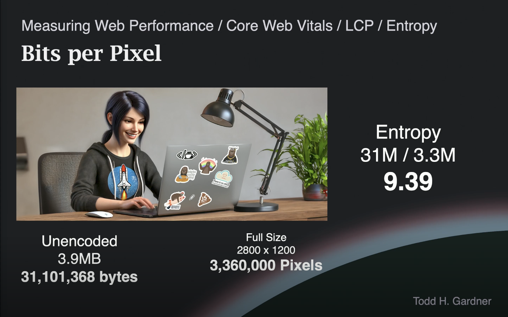
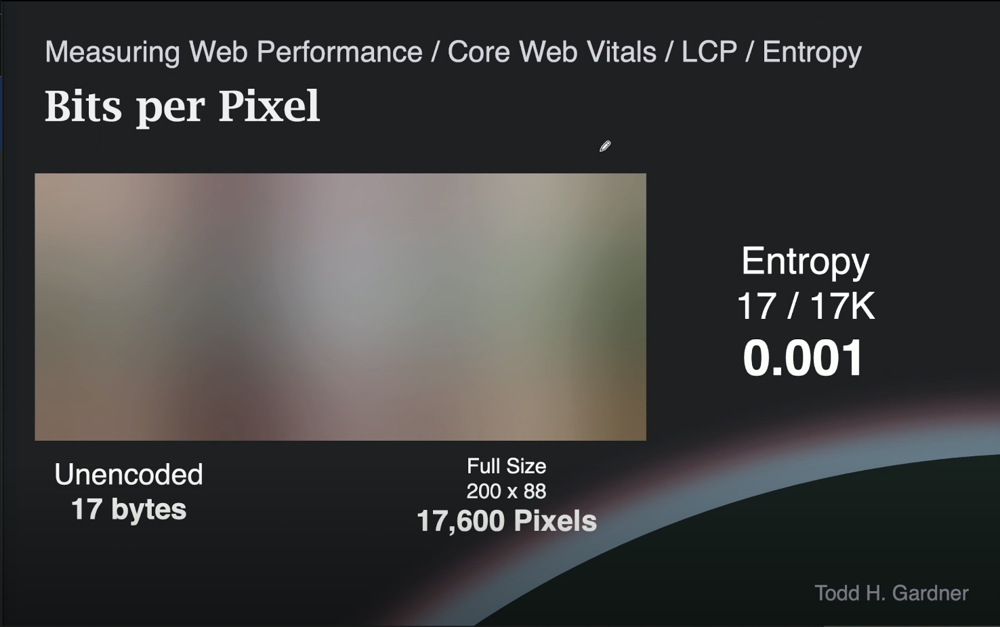
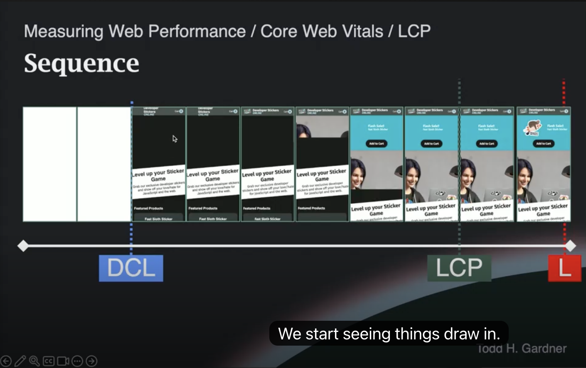

# Web Performance Fundamentals v2 - 최대 콘텐츠풀 페인트 (Largest Contentful Paint)

## 1. 핵심 웹 지표 (Core Web Vitals) 개요

**핵심 웹 지표(Core Web Vitals)**는 Google이 정의한 세 가지 구체적인 성능 유형을 측정하는 지표다.

| 지표 | 약어 | 측정 항목 |
|------|------|-----------|
| 최대 콘텐츠풀 페인트 (Largest Contentful Paint) | **LCP** | 가장 중요한 요소가 얼마나 빠르게 시각적으로 로딩되는가 |
| 누적 레이아웃 이동 (Cumulative Layout Shift) | **CLS** | 로딩 중 레이아웃이 얼마나 안정적으로 유지되는가 |
| 다음 페인트까지의 상호작용 (Interaction to Next Paint) | **INP** | 사용자가 얼마나 빠르게 상호작용할 수 있는가 |

이 세 지표는 **검색 순위(search ranking)의 직접적인 결정 요소(ranking factors)**다. 다른 성능 지표들도 중요하지만, 이 세 가지가 SEO와 웹 성능 분야에서 특히 주목받는 이유가 여기에 있다.

---

## 2. LCP란 무엇인가

**LCP(Largest Contentful Paint)**는 페이지에서 **픽셀 면적 기준으로 가장 큰 요소**가 완전히 렌더링되는 데 걸리는 시간을 측정한다.

### 왜 "가장 중요한" 요소가 아니라 "가장 큰" 요소인가?

개발자가 직접 중요한 요소를 지정할 수 있다면, 즉시 로딩되는 작은 빈 `div`를 중요 요소로 지정해 LCP 점수를 인위적으로 높이는 조작이 가능하다. 따라서 Google은 **사용자가 실제로 보기에 가장 눈에 띄는 요소**, 즉 픽셀 면적상 가장 큰 요소를 기준으로 삼는다.

### LCP 측정 대상 요소

다음 유형의 요소만 LCP 후보로 간주된다:

- `` 이미지
- `<video>` 동영상
- CSS 배경 이미지 (`background-image`)
- 텍스트를 포함하는 모든 DOM 요소

---

## 3. LCP 적용 규칙

페이지에 존재한다고 해서 모든 요소가 LCP 후보가 되는 것은 아니다. 다음 세 가지 규칙이 적용된다:

| 규칙 | 설명 |
|------|------|
| **불투명도 0 제외** | `opacity: 0`으로 설정된 요소는 LCP 대상에서 제외. 투명 요소를 크게 만들어 점수를 조작하는 것을 방지 |
| **전체 페이지 크기 초과 제외** | 뷰포트 전체를 덮는 요소는 배경으로 간주되어 제외 |
| **저엔트로피 이미지 제외** | 이미지 엔트로피(entropy)가 **0.05 미만**이면 LCP 대상에서 제외 |

---

## 4. 이미지 엔트로피 (Image Entropy)

**엔트로피(Entropy)**는 클로드 섀넌(Claude Shannon)이 1948년 정보 이론(Information Theory)에서 정립한 개념으로, "얼마나 많은 정보가 담겨 있는가"를 나타냅니다. LCP에서는 이를 이미지의 시각적 데이터 밀도를 측정하는 데 활용합니다. Google CWV 공식 문서에서 일반 용어로 노출되지는 않지만, Chrome 구현과 Web Vitals 스펙에서 제외 기준값(`0.05`)이 명시되어 있습니다.

엔트로피는 이미지의 시각적 데이터 밀도를 나타내는 값으로, 다음 공식으로 계산됩니다:

```
엔트로피 = 인코딩되지 않은 이미지 바이트 수 / 렌더링되는 총 픽셀 수
```

> **Unencoded(미인코딩)란?** PNG/JPEG 등의 압축 알고리즘이 적용되기 전, 각 픽셀의 RGBA 값을 그대로 나열한 원시 데이터 크기입니다. 1픽셀 = 4bytes(R+G+B+A)이므로 2,800×1,200 이미지의 unencoded 크기는 약 13.4MB에 달합니다. 엔트로피 계산에 unencoded 크기를 사용하는 이유는 압축률에 관계없이 이미지가 담고 있는 **실제 정보량**을 기준으로 삼기 위해서입니다.

### 예시 비교





| 항목 | 고엔트로피 이미지 | 저엔트로피 이미지 (블러 플레이스홀더) |
|------|------------------|--------------------------------------|
| 원본 크기 (미인코딩) | 3.9 MB (3,100만 바이트) | 17 바이트 |
| 렌더링 크기 | 2,800 × 1,200 (330만 픽셀) | 200 × 88 |
| 엔트로피 점수 | **9.39** ✅ LCP 인정 | **0.001** ❌ LCP 제외 |
| 설명 | 실제 히어로 이미지 | 심하게 블러 처리된 플레이스홀더 |

### 블러 플레이스홀더 패턴의 함정

많은 개발자들이 UX 개선을 위해 **블러 처리된 저해상도 이미지를 플레이스홀더로 사용하고, JavaScript로 나중에 실제 이미지로 교체**하는 패턴을 사용한다. 그러나 이 패턴은 LCP 점수 향상에 **실질적인 도움이 되지 않는다**. 플레이스홀더 이미지의 엔트로피가 0.05 미만이면 LCP 대상 자체가 되지 않기 때문이다. 결국 실제 이미지가 로딩될 때 LCP 이벤트가 발생한다.

### JavaScript로 엔트로피 계산하기

페이지의 모든 이미지에 대한 엔트로피를 JavaScript로 계산할 수 있다. 코드 샘플은 저장소의 `public/assets/javascript/code-samples` 경로에 있다.

```javascript
// 대략적인 동작 원리
// 1. src 속성이 있는 모든 이미지를 가져옴
// 2. 각 이미지의 바이트 수(파일 크기)를 파악
// 3. 렌더링되는 픽셀 수를 계산
// 4. 바이트 / 픽셀 = 엔트로피 점수
```

> **활용 범위**: 블러 플레이스홀더나 배경 패턴을 사용하는 사이트에서 특히 유용하다. 해당 패턴을 사용하지 않는다면 크게 필요하지 않다.

---

## 5. 실제 LCP 요소 결정 과정

LCP 요소는 **로딩 타이밍에 따라 달라질 수 있습니다**. LCP 측정은 다음 두 조건 중 하나가 발생하면 중단되며, 결과가 다릅니다.

| 중단 조건 | 결과 |
|---|---|
| **첫 번째 사용자 상호작용** (클릭, 타이핑 등) | 그 시점까지 로딩된 요소 중 가장 큰 것으로 LCP 확정 |
| **페이지가 백그라운드로 전환** (탭 전환, 앱 전환 등) | LCP 데이터 자체가 수집되지 않음 |

예를 들어 히어로 이미지 로딩이 매우 느려 사용자가 먼저 클릭을 시작하면, 그 시점까지 로딩된 요소 중 가장 큰 것이 LCP로 확정됩니다.

| 상황 | LCP 요소 | 크기 |
|------|----------|------|
| 히어로 이미지 로딩 전 사용자 상호작용 발생 | 히어로 콘텐츠 문단 (hero content `<p>`) | 662 × 112px = 74,000px² |
| 일반적인 경우 | 데스크 히어로 이미지 (desk hero desktop) | 1,740 × 640px = **1,113,600px²** |

### LCP 발생 시점 (필름 스트립 기준)



모바일 로딩 순서:
1. 빈 페이지 렌더링
2. 텍스트/UI 요소 그려지기 시작
3. 히어로 이미지 점진적 렌더링
4. **히어로 이미지 완성 → LCP 이벤트 발생** (이 경우 load 이벤트보다 먼저)

> load 이벤트와 LCP의 선후 관계는 사이트 구성 방식에 따라 달라진다. 핵심 웹 지표 관점에서는 load 이벤트 타이밍보다 **LCP 발생 시점이 중요**하다.

#### 왜 LCP가 load보다 먼저 발생할까?

- **load 이벤트**: 페이지의 <b>모든 서브리소스</b>(푸터 이미지, 아이콘, 광고, 써드파티 스크립트, 분석 트래커, 폰트 등)가 전부 받아져야 발생
- **LCP**: <b>가장 큰 요소 하나</b>만 완성되면 기록되며, 나머지 후순위 리소스는 기다리지 않음

브라우저는 리소스마다 우선순위를 다르게 부여한다. 뷰포트 내의 큰 이미지(LCP 후보)는 <b>High 우선순위</b>로 먼저 다운로드되고, 푸터 이미지·광고·트래커 등은 <b>Low 우선순위</b>로 나중에 받아진다. 결과적으로 잘 최적화된 페이지에서는 LCP가 load보다 먼저 발생하는 것이 자연스럽다.

```
[HTML]──[CSS]──[히어로 이미지]──[LCP 발생]
                     ↓
               [푸터 이미지 / 광고 / 트래커 / 분석 스크립트]
                     ↓
               [load 이벤트 발생]
```

이것이 load 이벤트가 더 이상 의미 있는 성능 지표로 쓰이지 않는 이유이기도 하다. load는 사용자 경험과 무관한 후순위 리소스에 의해 좌우되기 때문이다.

---

## 6. 디자인을 통한 LCP 제어

**디자인 선택이 LCP 요소를 결정한다.** 뷰포트의 80%를 차지하는 배너를 추가하면 그것이 가장 큰 요소가 되어 LCP 기준 요소가 된다.

핵심 원칙:
- 사용자에게 "이것이 중요하다"는 신호를 주고 싶은 요소를 **가장 크게** 만들어라.
- 그 요소를 **최대한 빠르게 로딩**되도록 최적화하라.

---

## 7. LCP 기타 고려사항

### LCP 측정 중단 조건

**첫 번째 사용자 상호작용 이후 LCP 측정이 중단된다.** 상호작용으로 인정되는 행동:
- ✅ 클릭 (Click)
- ✅ 키보드 타이핑
- ❌ 스크롤 (스크롤은 상호작용으로 인정되지 않음)
- ❌ 마우스 올리기/Hover (항상 어딘가에 올려져 있으므로 제외)

### LCP 목표 기준

| 등급 | 기준 |
|------|------|
| ✅ 양호 (Good) | **2.5초 이내** |
| ⚠️ 개선 필요 | 2.5초 ~ 4.0초 |
| ❌ 불량 (Poor) | 4.0초 초과 |

> 2.5초 기준은 연구 데이터에 근거한다. 페이지 로딩이 2초를 초과하면 사용자의 집중 흐름(flow)이 끊기기 시작한다는 연구 결과를 반영한다.

### 패널티

2.5초 초과 시 Google 검색 순위에 직접적인 불이익이 있다. 구체적인 패널티 수치는 Google의 독점 정보이지만, **점수와 상위 10개 검색 결과 순위 간 직접적인 상관관계**가 있다는 것은 알려진 사실이다.

---

## 8. DOMContentLoaded/Load 이벤트와 LCP의 관계

LCP는 DOMContentLoaded나 load 이벤트와 독립적으로 동작한다. 핵심 웹 지표 관점에서는 **load 이벤트 타이밍이 더 이상 의미 있는 성능 지표가 아니다**.

### SPA에서의 DOMContentLoaded/Load 이벤트

완전히 클라이언트 사이드 렌더링(CSR)되는 SPA의 경우:
- 초기 HTML에 실제 콘텐츠가 거의 없음
- DOMContentLoaded와 load 이벤트가 매우 빠르게 발생
- 실제 콘텐츠는 이후 JS 실행으로 채워짐
- 이 패턴이 두 이벤트를 **성능 측정 지표로서 무의미하게 만든 원인**

> Google이 사이트를 객관적으로 비교하는 기준으로는 DOMContentLoaded/Load 이벤트를 활용하지 않는다. 다만, 개발자가 자신의 사이트 내부 동작을 이해하는 용도로는 여전히 유용하다.

---

<details>
<summary>Core Web Vitals는 세 가지 지표뿐인가요?</summary>

Core Web Vitals는 현재 세 가지 지표로 구성된다: **LCP**(로딩 성능), **INP**(상호작용 응답성), **CLS**(시각적 안정성). INP는 2024년 3월 FID를 대체했다.

이 세 지표 외에도 Web Vitals(비-Core)로 분류되는 지표가 존재한다:
- **FCP** (First Contentful Paint) — 첫 콘텐츠 렌더링 시간
- **TTFB** (Time to First Byte) — 서버 응답 속도
- **TBT** (Total Blocking Time) — 메인 스레드 블로킹 총합

Core Web Vitals만이 Google SEO 랭킹 신호로 사용되는 공식 지표이며, 향후 구성이 변경될 수 있다.

</details>

<details>
<summary>opacity: 0인 요소를 이용해 LCP를 조작하는 방법은 무엇인가요?</summary>

opacity: 0으로 설정된 크고 투명한 요소를 페이지에 배치하여 즉시 로딩시키는 방식입니다.

```html
<div style="width: 100vw; height: 100vh; opacity: 0;">
  <!-- 아무 내용 없음 -->
</div>
```

이 요소는 사용자 눈에 보이지 않지만, 픽셀 면적상 가장 크기 때문에 규칙이 없다면 LCP 요소로 선정됩니다. HTML과 함께 즉시 렌더링되므로 LCP 시간이 거의 0에 가깝게 측정될 수 있습니다. Google은 이를 막기 위해 opacity: 0인 요소를 LCP 대상에서 제외하는 규칙을 두었습니다.

</details>

<details>
<summary>브라우저는 이미지 엔트로피를 어떻게 계산하나요?</summary>

이미지 URL만으로는 엔트로피를 알 수 없습니다. 브라우저는 이미지를 **다운로드하고 디코딩(압축 해제)한 뒤에야** 원시 픽셀 데이터(unencoded bytes)를 확보할 수 있습니다.

엔트로피 계산에 필요한 두 값의 확보 시점은 다음과 같습니다.

- **unencoded bytes** — 이미지 다운로드 + 디코딩 완료 후 확정
- **렌더링 픽셀 수** — 레이아웃 단계에서 CSS·컨테이너 크기를 기반으로 미리 확정

```
이미지 다운로드 → 디코딩(unencoded bytes 확보) ┐
                                                ├→ 엔트로피 계산 → LCP 후보 여부 판단
레이아웃 완료(렌더링 픽셀 수 확보) ─────────────┘
```

따라서 저엔트로피 이미지라도 다운로드와 디코딩은 정상적으로 수행되며, 그 이후에 LCP 후보에서 제외됩니다. 아무리 빠르게 로드되어도 LCP에 영향을 줄 수 없는 이유가 여기에 있습니다.

참고로 이미지 디코딩은 일반적으로 **페인트 직전**에 수행됩니다. 이 측정값은 Chrome이 수집하여 CrUX(Chrome User Experience Report)를 통해 Google로 집계됩니다.

</details>

---

## Quiz

**Q1.** 다음 중 LCP 후보 요소에서 <b>제외되는</b> 경우가 아닌 것은?

a) `opacity: 0`으로 설정된 큰 `<div>`\
b) 뷰포트 전체 크기를 초과하는 배경 요소\
c) 엔트로피가 0.03인 200×88 블러 플레이스홀더 이미지\
d) 화면 면적의 80%를 차지하는 히어로 ``

<details>
<summary>정답 보기</summary>

**d) 화면 면적의 80%를 차지하는 히어로 ``** — 나머지 보기는 모두 LCP 제외 규칙(불투명도 0, 전체 페이지 크기 초과, 엔트로피 0.05 미만)에 해당한다.

</details>

---

**Q2.** LCP는 다음 중 어느 시점에 기록되는가?

a) 이미지 다운로드가 완료된 시점\
b) 이미지 디코딩이 완료된 시점\
c) 디코딩된 픽셀이 화면에 페인트된 시점\
d) 이미지 요청이 시작된 시점

<details>
<summary>정답 보기</summary>

**c) 디코딩된 픽셀이 화면에 페인트된 시점** — LCP는 W3C 명세상 "render time"으로 정의되며, 사용자가 실제로 콘텐츠를 인지하는 순간을 측정한다.

</details>

---

**Q3.** 일반적으로 잘 최적화된 페이지에서 <b>LCP가 load 이벤트보다 먼저 발생</b>하는 가장 큰 이유는?

a) LCP는 가장 큰 요소 하나만 기다리지만, load는 푸터 이미지·광고·트래커 등 모든 서브리소스를 기다리기 때문\
b) 브라우저가 LCP 이벤트를 load보다 먼저 강제로 발생시키도록 명세에 정해져 있기 때문\
c) load 이벤트는 JavaScript가 실행된 후에만 발생하기 때문\
d) LCP는 DOMContentLoaded 직후 항상 발생하기 때문

<details>
<summary>정답 보기</summary>

**a) LCP는 가장 큰 요소 하나만 기다리지만, load는 푸터 이미지·광고·트래커 등 모든 서브리소스를 기다리기 때문** — 브라우저는 LCP 후보 이미지를 High 우선순위로 먼저 받고, 후순위 리소스가 끝난 뒤에야 load가 발생한다.

</details>

---

**Q4.** 다음 중 LCP 측정을 <b>중단시키는</b> 사용자 행동은?

a) 마우스 hover\
b) 페이지 스크롤\
c) 빈 영역 클릭\
d) 마우스 이동

<details>
<summary>정답 보기</summary>

**c) 빈 영역 클릭** — 클릭과 키보드 타이핑은 상호작용으로 인정되어 LCP 측정을 중단시킨다. hover와 스크롤은 상호작용으로 간주되지 않는다.

</details>

---

**Q5.** 2,800×1,200 크기의 블러 처리된 이미지가 있다. 원본 해상도가 그대로 2,800×1,200이고 unencoded 크기가 약 13.4MB라면, 이 이미지는 LCP 후보가 될 수 있을까?

a) 블러 처리되어 있으므로 무조건 제외된다\
b) 엔트로피가 약 4.0으로 0.05를 훨씬 넘으므로 LCP 후보가 된다\
c) 이미지가 너무 크므로 "전체 페이지 크기 초과" 규칙으로 제외된다\
d) 디코딩 시간이 길어 자동 제외된다

<details>
<summary>정답 보기</summary>

**b) 엔트로피가 약 4.0으로 0.05를 훨씬 넘으므로 LCP 후보가 된다** — 엔트로피 규칙이 실제로 막는 것은 "블러 이미지"가 아니라 "저해상도로 다운샘플링된 플레이스홀더"다. 원본 해상도가 높으면 블러 이미지라도 unencoded bytes가 크기 때문에 LCP 후보가 될 수 있다.

</details>

