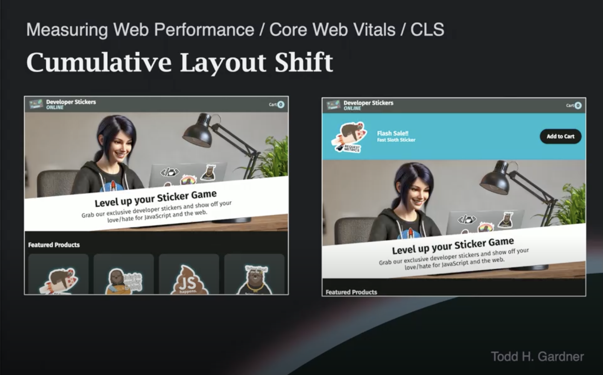
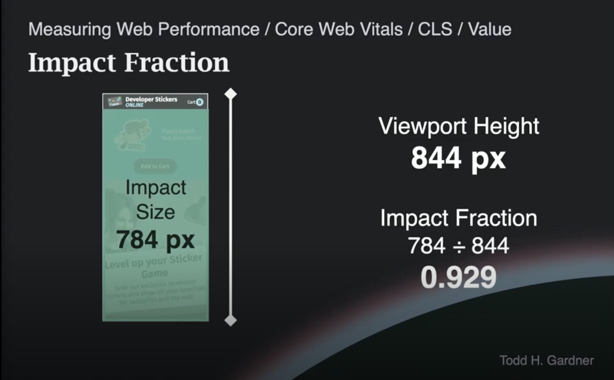

# Web Performance Fundamentals v2 - Cumulative Layout Shift (CLS)

## 1. CLS란 무엇인가

**누적 레이아웃 시프트(Cumulative Layout Shift, CLS)** 는 두 번째 코어 웹 바이탈(Core Web Vital) 지표로, 페이지에 요소들이 얼마나 **부드럽고 예측 가능하게** 로드되는지를 측정합니다.

- 로딩 시퀀스 동안 요소들이 이리저리 움직이거나 재배치되는지를 측정합니다.
- 사용자가 페이지를 **예측 가능**하다고 느끼는지가 핵심입니다.
- 페이지가 예측 가능하다고 느껴질수록 사용자는 더 빨리 페이지와 상호작용할 수 있습니다.

<details><summary>용어에 대한 부연 설명</summary>

코어 웹 바이탈의 용어들은 다소 복잡하고 거창한 단어로 이루어져 있어 비기술자에게 설명하기 어렵습니다. 하지만 개념 자체는 단순하므로 하나씩 풀어서 이해하면 됩니다.

</details>

---

## 2. 실제 환경에서의 레이아웃 시프트

레이아웃 시프트(layout shift)는 사용자가 페이지와 상호작용하려는 순간, 광고 등 새로운 요소가 비동기적으로 끼어들면서 발생합니다.

- 사용자는 페이지가 다 로드되었는지 확신할 수 없어 좌절감을 느낍니다.
- 일부 사이트는 사용자가 광고를 **실수로 클릭**하도록 의도적으로 이런 패턴을 사용하는 경우도 있습니다 — 전형적인 **안티패턴(anti-pattern)** 입니다.
- 구글이 CLS를 측정하기 시작하면서 이러한 안티패턴에 SEO 페널티를 부과해 점점 줄여나가고 있습니다.
- 그러나 의도적인 경우뿐 아니라, 많은 개발자들이 실수로 이런 문제를 일으키기도 합니다.

---

## 3. shifty.site - The Layout Shift Challenge

강사가 직접 만든 오픈소스 데모 게임으로, 극단적인 레이아웃 시프트가 사용자에게 얼마나 큰 좌절감을 주는지를 체험할 수 있습니다.

- 주소: `shifty.site`
- 사이트가 의도적으로 수많은 레이아웃 시프트를 발생시킵니다.
- 도전 과제: 레이아웃이 정신없이 바뀌는 동안 **오늘의 특가(deal of the day)** 상품을 장바구니에 담는 것입니다.
- 새로운 위젯이 로드될 때마다, 나머지 문서가 그 주변으로 밀려나면서 레이아웃 시프트가 발생합니다.
- 이 게임의 CLS 점수는 **14.58** 로, 비현실적으로 큰 수치입니다.

---

## 4. 레이아웃 시프트 측정 공식

레이아웃 시프트 점수는 다음 공식으로 계산됩니다.

```
Layout Shift Score = Impact Fraction × Distance Fraction
```

| 항목 | 의미 |
|---|---|
| **임팩트 분율(Impact Fraction)** | 이동한 요소가 **이동 전·후 두 프레임에서 차지한 영역의 합집합(union)** ÷ 뷰포트 면적 |
| **거리 분율(Distance Fraction)** | 이동한 요소가 뷰포트 내에서 움직인 **거리** ÷ 뷰포트 크기 |

- 측정 대상은 오직 **뷰포트(viewport)**, 즉 사용자의 화면에서 보이는 부분입니다.
- 페이지 전체가 아니라 뷰포트에 한정해서 측정합니다.

> ⚠️ **흔한 오해:** 임팩트 분율을 "이동 후 화면에 남아 있는 콘텐츠 영역"으로 오해하기 쉽지만, 정확히는 **이동 전 위치 + 이동 후 위치의 합집합**입니다. 즉, 헤더처럼 고정된 영역만 빼면 사실상 "헤더 아래 모든 영역"이 잡히는 경우가 많아 임팩트 분율은 거의 1에 가깝게 나옵니다.

---

## 5. 데스크톱 예시 - 프로모션 배너 시프트

개발자 스티커 사이트에서 페이지 상단에 프로모션 배너(promo banner)가 늦게 로드되어 나머지 문서를 아래로 밀어내는 상황을 가정합니다.



**조건:**
- 뷰포트 높이(viewport height): **768 픽셀**
- 상단 헤더 높이: 60 픽셀
- 프로모션 배너 높이: 180 픽셀

**임팩트 사이즈(Impact Size) 계산 - 합집합 방식:**

| 단계 | 영역 | 픽셀 범위 | 크기 |
|---|---|---|---|
| 이동 전 | 헤더 아래 콘텐츠 위치 | 60 ~ 768px | 708px |
| 이동 후 | 콘텐츠가 180px 아래로 밀려난 위치 | 240 ~ 768px | 528px |
| **합집합** | 두 프레임에서 콘텐츠가 차지한 모든 영역 | **60 ~ 768px** | **708px** |

- Impact Size = **708 픽셀**

**임팩트 분율:**
```
Impact Fraction = 708 / 768 ≈ 0.922
```
즉, 뷰포트의 **92.2%** 가 이 시프트의 영향을 받았습니다.

**거리 분율:**
- 프로모션 배너의 높이(180px)만큼 콘텐츠가 아래로 이동했습니다.
```
Distance Fraction = 180 / 768 ≈ 0.234
```

**최종 레이아웃 시프트 값:**
```
Score = 0.922 × 0.234 ≈ 0.215
```

> 두 분율을 곱했기 때문에 결과는 더 이상 백분율이 아니며, 구글은 이를 단순히 점수(score) 또는 값(value)이라고 부릅니다.

<details><summary>참고: 높이만 측정하는 단순화</summary>

레이아웃 시프트는 실제로는 높이와 너비 두 차원 모두에서 발생할 수 있습니다. 위 예시는 계산을 단순화하기 위해 모든 요소가 아래로 이동하는 경우만 다뤘습니다.

</details>

---

## 6. 모바일 예시 - 같은 시프트, 더 큰 점수

동일한 프로모션 배너 시프트가 모바일에서 발생하면 점수가 더 커집니다.



| 지표 | 데스크톱 | 모바일 |
|---|---|---|
| 뷰포트 높이 | 768px | 844px |
| 헤더 높이 | 60px | 60px (가정) |
| 배너 높이 | 180px | **약 260px** (역산값) |
| 이동 전 콘텐츠 위치 | 60 ~ 768px (708px) | 60 ~ 844px (784px) |
| 이동 후 콘텐츠 위치 | 240 ~ 768px (528px) | 320 ~ 844px (524px) |
| **합집합 (Impact Size)** | **708px** | **784px** |
| Impact Fraction | 708 / 768 ≈ **0.922** | 784 / 844 ≈ **0.929** |
| Distance Fraction | 180 / 768 ≈ **0.234** | 260 / 844 ≈ **0.308** |
| Layout Shift Score | 0.922 × 0.234 ≈ **0.215** | 0.929 × 0.308 ≈ **0.286** |

> **참고:** 강사는 transcript에서 모바일 배너 높이를 직접 언급하지 않았습니다. 위 260px은 거리 분율 0.308 × 뷰포트 844px로 역산한 값입니다. 동일 배너가 모바일에서 더 길어지는 이유는 좁은 가로 폭으로 인해 텍스트가 줄바꿈되고, 요소들이 세로로 쌓이도록 반응형 디자인되기 때문입니다.

- **이유:** 모바일은 가로 폭이 좁기 때문에 디자인 자체가 세로로 길게 배치되도록 **의도적으로 설계**됩니다. 데스크톱에서 가로로 나란히 놓이던 요소들이 모바일에서는 세로로 쌓이게 되며, 그 결과 같은 "배너 삽입" 사건이라도 영향을 받는 콘텐츠 영역이 뷰포트 대비 **더 큰 비율**을 차지하게 됩니다. (이 예시에서도 모바일 뷰포트 높이는 844px로 데스크톱(768px)보다 오히려 더 길지만, 임팩트 분율과 거리 분율 모두 모바일이 더 높습니다.)
- 즉, **뷰포트 대비 시프트 비율이 클수록 더 큰 점수**가 산출됩니다.
- 이것이 바로 구글이 CLS, LCP, INP 세 가지 코어 웹 바이탈 모두를 **데스크톱과 모바일 양쪽에서 별도로** 수집하는 이유입니다.

---

## 7. 구글은 데스크톱과 모바일 점수를 어떻게 다루는가

구글은 **양쪽 모두**를 신경 씁니다. 코어 웹 바이탈 데이터는 데스크톱과 모바일에서 **별도로 수집**됩니다.

- 다만 데스크톱 점수가 데스크톱 검색 순위에, 모바일 점수가 모바일 검색 순위에 영향을 미치는지는 **구글이 명시적으로 밝힌 적이 없습니다.**
- 이는 추측될 뿐, 확실하지 않습니다.

**참고 - 모바일 우선 인덱싱(Mobile-first Indexing):**
- 2017~2018년경부터 구글은 웹사이트를 인덱싱할 때 **모바일 버전**을 사용합니다.
- 데스크톱에서만 보이는 콘텐츠는 구글 인덱스에 포함되지 않습니다.
- 이로 인해 "구글이 모바일 점수만 신경 쓴다"고 주장할 여지는 있지만, 구글이 직접 그렇게 말하거나 데이터로 입증된 적은 없습니다.

<details><summary>Q. 데스크톱/모바일 데이터를 별도로 수집한다는데, 디바이스 종류로 구분하는 건가요?</summary>

네, **디바이스의 폼 팩터(form factor)** 로 구분합니다. 단순 뷰포트 크기가 아니라 브라우저가 보내는 **User-Agent 문자열**에서 추론합니다. (Client Hints는 별도 표준이지만 CrUX 분류에는 사용되지 않습니다.)

- 데스크톱에서 창을 좁게 줄여도 **데스크톱 데이터로 집계**됨 (UA가 그대로이므로)
- CrUX는 `phone` / `tablet` / `desktop` 3가지로 분류
- 안드로이드의 경우 UA에 `Mobile` 키워드 유무로 phone/tablet을 가름 (OS가 화면 크기·DPI로 판단한 결과를 크롬이 그대로 전달)

</details>

<details><summary>Q. CrUX는 크롬 사용자 데이터만 수집한다는데, Safari 사용자는?</summary>

**CrUX는 이름 그대로 크롬 사용자만 수집합니다.** Safari·Firefox·Edge는 모두 미포함이며, 특히 **iOS는 모든 브라우저가 WebKit을 강제로 써야 했기 때문에 iOS 크롬조차도 CrUX에 데이터를 보내지 않습니다.**

→ iOS 사용자 비중이 높은 사이트는 CrUX 표본이 실제 트래픽보다 훨씬 적으므로, **자체 RUM 도구**(Sentry, Datadog 등)로 측정해야 Safari/iOS 사용자 경험을 파악할 수 있습니다.

</details>

<details><summary>Q. FE 개발자가 알아야 할 폼 팩터의 공식 분류는?</summary>

폼 팩터에는 단일 표준이 없으며, **"laptop"은 어떤 웹 표준에도 별도 카테고리로 존재하지 않고 항상 `desktop`에 포함**됩니다.

| 표준 | 공식 값 |
|---|---|
| **CrUX / PageSpeed Insights** | `phone`, `tablet`, `desktop` (3가지) |
| **W3C Client Hints** (`Sec-CH-UA-Form-Factors`) | `Desktop`, `Mobile`, `Tablet`, `Automotive`, `XR`, `EInk`, `Watch` (7가지) |

**FE 관점:** 단순 화면 크기가 아니라 **"화면 크기 + 입력 방식 + 사용 맥락"의 조합**으로 봐야 합니다. CSS 미디어 쿼리 `pointer: coarse/fine`, `hover: hover/none`로 입력 방식을 분기하세요.

</details>

<details><summary>Q. <code>pointer: coarse/fine</code>은 무엇인가요?</summary>

CSS 미디어 쿼리로 <b>주요 입력 장치의 정밀도</b>를 감지합니다.

- <b>`pointer: coarse`</b> — 손가락 같은 <b>부정확한 입력</b> (터치스크린)
- <b>`pointer: fine`</b> — 마우스·스타일러스 같은 <b>정밀한 입력</b>
- <b>`pointer: none`</b> — 포인팅 장치 없음 (TV 리모컨 등)

```css
@media (pointer: coarse) { button { min-height: 44px; } } /* 터치 타깃 크게 */
@media (pointer: fine)   { button { min-height: 32px; } } /* 마우스는 작게 OK */
```

화면 크기와 무관하게 <b>입력 방식</b>으로 분기할 때 씁니다. 예: 터치스크린 노트북은 화면은 크지만 `pointer: coarse`입니다.

</details>

---

## 8. 높이와 너비 모두에 적용

레이아웃 시프트는 **높이와 너비 두 차원 모두**에 적용됩니다.

- 위 예시들은 단순화를 위해 높이 시프트만 다뤘습니다.
- 너비 시프트도 같은 방식으로 일어납니다. 예를 들어, 텍스트 옆에 이미지가 늦게 로드되어 텍스트가 옆으로 밀려나는 경우입니다.
- 두 차원이 모두 관련되면 계산은 훨씬 복잡해집니다.

> 실제 블링크(Blink) 소스 코드에서 이 계산을 수행하는 부분은 약 600줄 분량의 매우 밀도 높은 C 코드입니다.

---

## 9. "누적(Cumulative)"의 의미

**누적(cumulative)** 이라는 단어는 단순히 **모든 레이아웃 시프트의 합**을 측정한다는 뜻입니다.

- 한 페이지에서 1개, 2개, 5개, 10개, 100개의 레이아웃 시프트가 발생할 수 있습니다.
- CLS는 발생한 **모든 레이아웃 시프트 점수를 합산**합니다.

### 카운트되지 않는 시프트

다음과 같은 경우는 CLS에 포함되지 않습니다.

- **사용자 동작(user action) 후 500밀리초 이내**에 발생한 레이아웃 시프트
  - 예: 아코디언을 펼치기 위한 클릭, 버튼 클릭으로 새로운 요소가 나타나는 경우
- 이런 패턴들은 페이지 동작의 정상적인 일부이므로, 페널티를 부여하지 않습니다.

### 사용자 동작의 정의

| 동작 유형 | 카운트 여부 |
|---|---|
| 클릭(click) | 시프트 발생 시 카운트 제외 (동작 후 500ms 이내) |
| 타이핑(type) | 시프트 발생 시 카운트 제외 (동작 후 500ms 이내) |
| **스크롤(scroll)** | 사용자 동작으로 간주되지 **않음** — 스크롤로 시프트가 발생해서는 안 됨 |

<details><summary>Q. 한 페이지에서 레이아웃 시프트는 어떻게 카운트되고 그룹핑되나요? (배너 2개면 시프트 2개?)</summary>

### 1. 시프트는 프레임(frame) 단위로 카운트

| 시나리오 | 시프트 개수 |
|---|---|
| 배너 A·B가 <b>같은 프레임에 동시 삽입</b> | 1개 (합집합으로 계산) |
| 배너 A 삽입 후 100ms 뒤에 B 삽입 | 2개 |
| 배너가 들어왔다가 200ms 뒤 크기 변경 | 2개 |

→ "배너가 2개니까 시프트 2개"가 아니라 <b>"몇 번의 프레임에 걸쳐 움직였는가"</b> 가 기준입니다.

### 2. "누적"은 단순 합이 아님 (2021년 6월 변경)

강사는 "모든 시프트의 합"으로 설명했지만, 2021년 6월부터 구글은 <b>Session Window 방식</b>으로 변경했습니다.

- 시프트 사이 간격이 <b>1초 이내</b>면 같은 세션으로 묶음
- 한 세션의 <b>최대 길이는 5초</b>
- <b>CLS = 모든 세션 윈도우 중 가장 큰 합산값</b>

```
시프트:  A(0.05) B(0.10) C(0.08) D(0.12) E(0.05) F(0.20)
시간:    0초     0.5초    1.2초   3초     3.4초   8초

세션:   [A+B=0.15]  [C=0.08]  [D+E=0.17]  [F=0.20]

CLS = max(0.15, 0.08, 0.17, 0.20) = 0.20
```

→ 단순 합(0.60)이 아니라 <b>가장 나쁜 세션의 합(0.20)</b>이 최종 점수. 이렇게 바꾼 이유는 SPA·무한 스크롤 같은 장수명 페이지가 시프트 누적으로 불이익 받지 않도록 하기 위함입니다.

</details>

---

## 10. CLS 점수 기준과 SEO 영향

좋은(good) 등급에 속하기 위한 기준은 매우 엄격합니다.

| 등급 | CLS 값 |
|---|---|
| **Good** | ≤ **0.1** |
| Needs Improvement | 0.1 ~ 0.25 |
| Poor | > 0.25 |

- 앞서 본 데스크톱 예시(0.215)와 모바일 예시(0.286) 모두 **나쁜 점수**에 해당하며, SEO 페널티를 받기에 충분합니다.
- shifty 게임의 CLS 점수는 18, 20, 24 정도로, 1.0보다 훨씬 큽니다.
- 따라서 **레이아웃 시프트를 사실상 거의 완전히 제거**해야 구글로부터 좋은 점수를 받을 수 있습니다.

> 다행히 이 문제를 제거하는 것은 어렵지 않으며, 다양한 좋은 방법들이 존재합니다. 이에 대해서는 마지막 섹션인 **CLS 개선** 부분에서 자세히 다룹니다.

---

## Q&A

<details>
<summary>클릭 후 API 응답이 느려서 500ms 이후에 UI가 추가되며 시프트가 발생했다면, 이건 CLS 문제인가요 아니면 INP 문제인가요?</summary>

<b>둘 다 손해입니다.</b>

- <b>INP:</b> 클릭부터 다음 프레임이 그려지기까지의 응답 속도 → 응답이 800ms 걸리면 INP가 그만큼 나쁘게 측정됨
- <b>CLS:</b> 시각적 안정성 → 늦게 도착한 UI가 기존 콘텐츠를 밀어내면, 500ms 윈도우를 넘긴 시프트는 더 이상 "사용자가 유발한 것"으로 간주되지 않아 CLS에 카운트됨

INP는 "<b>빠르게 반응하라</b>", CLS는 "<b>흔들지 마라</b>"는 다른 요구입니다. 응답이 800ms여도 스켈레톤으로 자리를 잡아뒀다면 CLS는 안전합니다.

</details>

<details><summary>Q. 글로벌 무신사처럼 반응형 웹 + 데스크톱/모바일 웹 + 앱 웹뷰 환경에서 참고할 만한 내용은?</summary>

### 1. CrUX 사각지대 인지

CrUX는 <b>크롬 사용자만</b> 수집합니다. iOS 모바일 웹과 iOS 앱 웹뷰(WKWebView)는 모두 미포함이며, 무신사처럼 iOS 비중이 큰 서비스는 PageSpeed Insights만 보면 절반 가까운 사용자를 놓칩니다.

→ <b>Datadog RUM 등 자체 RUM</b>으로 보완하되, 환경별 측정 가능 범위가 다르다는 점을 알아야 합니다.

| 환경 | 엔진 | LCP | CLS | INP |
|---|---|---|---|---|
| 데스크톱 / Android 웹 | Blink | ✅ | ✅ | ✅ |
| <b>Android 앱 웹뷰</b> | Blink | ✅ | ✅ | ✅ |
| iOS 모바일 웹 (Safari) | WebKit | ⚠️ 16+ | ❌ | ❌ |
| <b>iOS 앱 웹뷰 (WKWebView)</b> | WebKit | ⚠️ 16+ | ❌ | ❌ |

→ <b>iOS 환경(웹·웹뷰)은 RUM으로도 CLS·INP를 못 잡습니다.</b> 합성 모니터링(실제 iPhone)·프록시 지표·코드 레벨 예방으로 우회해야 합니다. 환경 4개 분리 태깅은 여전히 가치 있지만, "측정"보다는 "환경별 동작 차이를 가시화"하는 목적입니다.

### 2. 패션 커머스에서 자주 나오는 CLS 원인

| 원인 | 해결책 |
|---|---|
| 상품 이미지 크기 미지정 | `width`/`height` 또는 `aspect-ratio` 필수 |
| 다국어 웹폰트 FOIT/FOUT | `font-display: optional`, `size-adjust` |
| 상단 프로모션 배너/쿠폰 | 배너 영역 공간 예약 |
| 가격/할인 지연 로딩 | 스켈레톤 UI로 최종 높이 확보 |
| 상품 카드 뱃지 lazy 로딩 | 뱃지 슬롯 최소 높이 고정 |
| iOS Safe Area 미고려 | `viewport-fit=cover` + `env(safe-area-inset-*)` |
| iOS 100vh 이슈 | `100dvh` 사용 |
| 웹뷰 네이티브 헤더 늦은 렌더 | 헤더 높이를 CSS 변수로 사전 주입 |

### 3. 사용자 동작 500ms 룰 활용

필터/정렬 클릭 후 500ms 이내 시프트는 카운트 제외 → <b>빠른 응답 + 스켈레톤 UI</b> 조합 필수. ⚠️ 스크롤은 사용자 동작이 아니므로 무한 스크롤 영역도 높이를 미리 잡아야 합니다.

</details>

<details><summary>Q. 글로벌 무신사 같은 반응형 커머스에서는 디바이스 분기를 어떻게 정의하는 게 좋나요?</summary>

핵심 원칙: <b>"디바이스가 무엇인가"가 아니라 "어떤 능력(capability)이 있는가"를 묻는 것</b>입니다. 하나의 `isMobile` 변수에 의존하지 말고, 목적별로 다른 신호를 쓰세요.

| 목적 | 사용할 신호 | 이유 |
|---|---|---|
| <b>레이아웃</b> (그리드, 여백) | `min-width` 미디어 쿼리 | 창 크기 자체가 본질. 디바이스명 대신 콘텐츠 기준 브레이크포인트 |
| <b>호버/툴팁/줌</b> | `@media (hover: hover)`, `(pointer: fine)` | 입력 방식이 본질. 터치스크린 노트북도 대응 가능 |
| <b>터치 타깃 크기</b> | `@media (pointer: coarse)` | 손가락 ≥44px 필요 |
| <b>뷰포트 단위</b> | `dvh`/`svh`/`lvh` | iOS 100vh 이슈 회피 |
| <b>safe-area</b> | `env(safe-area-inset-*)` | 노치/홈 인디케이터 |
| <b>RUM 분류</b> | UA + 커스텀 태그 | CrUX와 일관성 + 웹뷰 분리 |

<b>흔한 함정:</b>
- `isMobile` 같은 단일 변수 만들지 말 것 → 태블릿·폴더블·터치 노트북에서 깨짐
- `window.innerWidth` JS 분기 대신 CSS 미디어 쿼리 우선 (꼭 필요하면 `matchMedia()`)
- UA 파싱은 모니터링·SSR 최후 수단으로만 (UA Reduction 추세)

<b>그럼 어떻게? — 콘텐츠 기준 브레이크포인트:</b> 변수명을 디바이스(`mobile`/`tablet`)가 아니라 <b>"콘텐츠가 어떻게 보여야 하는가"</b>로 짓습니다.

```css
:root {
  --bp-card-2col: 600px;     /* 상품 카드 2열 가능 */
  --bp-card-3col: 905px;     /* 상품 카드 3열 가능 */
  --bp-show-sidebar: 1024px; /* 필터 사이드바 등장 */
}
```

또는 Material Design의 <b>Window Size Class</b> 방식: `compact` / `medium` / `expanded` / `large`. 이름이 디바이스가 아닌 "창 크기 등급"이라 새 기기가 나와도 무너지지 않습니다. CSS·JS·Tailwind 모두 <b>디자인 토큰 한 곳</b>에서 공유하세요.

이 접근을 <b>capability detection</b> 또는 <b>progressive enhancement</b>라고 하며, 반응형 웹의 정석입니다.

</details>

<details><summary>Q. Datadog RUM으로 코어 웹 바이탈을 측정한다는 것은, 크롬 기준 개념을 크롬 외 환경에서도 측정 가능하게 해준 것으로 이해하면 되나요?</summary>

거의 맞지만, 브라우저별 측정 가능 항목에 한계가 있습니다.

<b>정확한 이해:</b>

- <b>개념·임계값·계산 공식</b>: 구글 코어 웹 바이탈 정의를 그대로 따름 (CLS ≤0.1, LCP ≤2.5s, INP ≤200ms)
- <b>측정 주체</b>: CrUX(크롬 텔레메트리)가 아니라 <b>브라우저에서 직접 JS로 측정</b>해 Datadog 서버로 전송 (대부분 구글의 `web-vitals` 라이브러리 사용)
- <b>대상</b>: JS가 실행되는 모든 브라우저 — 단, 필요한 `PerformanceObserver` API를 브라우저가 지원해야 함

<b>브라우저별 측정 가능 항목:</b>

| 지표 | Chrome | Safari | Firefox |
|---|---|---|---|
| FCP / TTFB | ✅ | ✅ | ✅ |
| LCP | ✅ | ⚠️ Safari 16+ 부분 | ❌ |
| <b>CLS</b> | ✅ | ❌ | ❌ |
| <b>INP</b> | ✅ | ❌ | ❌ |

→ <b>CLS·INP는 사실상 크로미움 계열(Chrome, Edge, 안드로이드 웹뷰)에서만 측정</b>됩니다. Safari·iOS 웹뷰는 LCP/FCP/TTFB 정도만 잡힙니다. RUM을 도입해도 iOS 사용자의 CLS·INP는 여전히 사각지대로 남으며, 이는 도구의 한계가 아니라 <b>WebKit의 API 미지원</b> 문제입니다.

<b>CrUX vs Datadog RUM 비교:</b>

| 항목 | CrUX | Datadog RUM |
|---|---|---|
| 브라우저 | 크롬만 | 모든 브라우저 (API 지원 한도 내) |
| 출처 | 크롬 텔레메트리 | 페이지 내 JS |
| 대상 URL | 공개 페이지만 | 로그인 후 페이지 포함 |
| 실시간성 | 28일 롤링 평균 | 실시간 |

</details>

<details><summary>Q. iOS/Safari에서 CLS·INP를 측정할 수 없는 사각지대를 글로벌 테크 기업들은 어떻게 해결하나요?</summary>

완벽한 해결책은 없고, <b>여러 방법을 조합해 근사치를 얻는 방향</b>으로 접근합니다.

<b>1. 폴리필 / 자체 구현</b>
- WebKit이 API를 안 주면 JS로 직접 만듦
- LCP: `MutationObserver` + `IntersectionObserver`로 "뷰포트에 들어온 가장 큰 요소" 추적 (Cloudflare가 오픈소스 공개)
- INP: `pointerdown`/`click`의 `event.timeStamp`와 직후 `requestAnimationFrame` 시간차로 응답 지연 추정
- CLS: `ResizeObserver`/`MutationObserver`로 프록시 지표 생성 (정확한 값은 불가)

<b>2. Synthetic Monitoring으로 보완</b>
- <b>Synthetic Monitoring이란?</b> RUM이 "실사용자가 페이지 방문할 때" 측정하는 것이라면, Synthetic은 <b>봇(스크립트)이 정해진 시나리오·환경으로</b> 페이지를 방문해 측정하는 방식. 실사용 분포는 반영 못 하지만 환경을 통제할 수 있어 회귀 감지·경쟁사 비교에 유리
- WebPageTest, SpeedCurve, Datadog Synthetics가 <b>실제 iPhone 기기</b>에서 정기 측정 → RUM이 못 잡는 iOS CLS·INP를 대신 측정
- 정석 조합: <b>"RUM(트렌드·실사용 분포) + Synthetic(정밀·사각지대 보완)"</b> 두 축 운영

<b>3. 프록시 지표로 대체</b>

| 못 재는 지표 | 프록시 |
|---|---|
| CLS | DOM 삽입 빈도, 이미지 `width/height` 누락 비율, 폰트 로딩 시간 |
| INP | Long Task 횟수, 메인 스레드 블로킹 시간, JS 번들 크기 |

<b>4. 비즈니스 지표로 우회 검증</b>
- iOS 사용자의 이탈률·전환율을 안드로이드와 비교 → 갭이 크면 성능 문제로 추정
- A/B 테스트로 최적화 효과를 매출로 증명

<b>5. "측정 못 하면 발생시키지 않는다" — 가장 현실적 전략</b>
- 모든 이미지에 `width`/`height` 강제 (lint·CI 차단)
- 폰트 `font-display: optional` 강제
- 광고·서드파티 슬롯 영역 사전 고정
- 무한 스크롤 placeholder 의무화

<b>실제 사례:</b> Shopify·Cloudflare·Vercel은 자체 RUM + 폴리필, Netflix·Pinterest는 합성 모니터링 + 프록시 지표 + iOS 별도 대시보드를 운영합니다.

<b>핵심 마인드셋:</b> "WebKit이 API를 줄 때까지 기다리지 말고, <b>측정할 수 없으면 예방하라</b>." 글로벌 테크가 가장 많이 의존하는 건 사실 측정 도구가 아니라 <b>코드 레벨 예방</b>입니다.

</details>

<details><summary>Q. Datadog 대시보드에 국가 필터만 있다면 어떤 필터를 추가하는 게 좋나요?</summary>

<b>환경별 필터는 필수</b>입니다. 평균 하나로 묶으면 가장 큰 문제가 가려지기 때문입니다.

<b>왜 필요한가:</b> 같은 페이지라도 환경에 따라 측정값·원인·해결책이 모두 다릅니다. 예를 들어 평균 CLS 0.18이라도 실제로는 데스크톱 0.05 / Android 웹 0.12 / Android 웹뷰 0.35일 수 있습니다.

<b>추가할 차원 (우선순위):</b>

| 차원 | 우선순위 | 분류 값 |
|---|---|---|
| <b>environment</b> | 🔴 필수 | `desktop_web` / `mobile_web` / `android_webview` / `ios_webview` |
| <b>OS</b> | 🔴 필수 | `iOS` / `Android` / `Windows` / `macOS` |
| <b>browser</b> | 🔴 필수 | `chrome` / `safari` / `firefox` / `edge` |
| <b>page type</b> | 🟡 권장 | `home` / `plp` / `pdp` / `cart` / `checkout` |
| <b>connection / app version</b> | 🟢 선택 | LCP 분석, 앱 회귀 추적 |

<b>웹뷰에만 있는 CLS 원인 (분리해야 보임):</b>
- 네이티브 헤더 오버레이가 늦게 렌더
- Safe Area 동적 적용
- 토큰 주입 후 사용자 정보 영역이 뒤늦게 채워짐
- 딥링크 진입 시 스크롤 복원

<b>비즈니스 임팩트도 다름:</b> 모바일 웹은 검색 유입·이탈률 중심, 앱 웹뷰는 충성 유저·결제 전환 중심 → 같은 점수 개선이라도 매출 임팩트가 다릅니다.

<b>태깅 방법:</b> URL 쿼리(`?from=app`)·커스텀 UA·JS bridge로 환경을 판별해 RUM 컨텍스트에 주입합니다. 앱팀과 표준화 협의가 첫 단계입니다.

> <b>왜 명시적 신호가 필요한가:</b> UA만으로는 "우리 앱의 웹뷰"와 "카카오톡·인스타 같은 인앱 브라우저"를 구분하기 어렵고, Android 웹뷰는 앱이 UA를 덮어쓰면 식별이 안 됩니다. Chrome의 UA Reduction 추세까지 고려하면, 앱팀이 명시적 식별자를 박아 넣는 것이 가장 견고합니다.

```javascript
datadogRum.setGlobalContextProperty('environment', detectEnvironment());
datadogRum.setGlobalContextProperty('page_type', getPageType());
```

<b>대시보드 구성:</b> `전체 평균 → 환경별 분할 → 환경 × 국가 → 환경 × 페이지 타입` 순으로 드릴다운.

<b>주의:</b>
- iOS 환경은 CLS·INP가 거의 비어 있을 것입니다(WebKit 한계). "데이터 없음"이 아닌 <b>"측정 불가(사각지대)"</b>임을 대시보드에 명시해야 잘못된 결론을 막습니다
- 알림(monitor)도 환경별로 분리해야 한 환경의 회귀가 다른 환경의 개선에 묻히지 않습니다

</details>

<details><summary>Q. <code>font-display: optional</code>은 어떨 때 필요한가요?</summary>

웹폰트 교체로 발생하는 <b>레이아웃 시프트(FOUT)</b>를 막기 위한 설정입니다.

<b>배경 — 웹폰트의 두 가지 문제:</b>
- <b>FOIT</b> (Flash of Invisible Text): 폰트 로드 전까지 텍스트를 안 보여줌 → 빈 페이지
- <b>FOUT</b> (Flash of Unstyled Text): 시스템 폰트로 먼저 보여주고 웹폰트 로드되면 교체 → <b>글자 너비 변화로 시프트 발생</b>

<b>`font-display` 값별 동작:</b>

| 값 | 동작 | CLS 영향 |
|---|---|---|
| `block` | 최대 3초 invisible | 🔴 |
| `swap` | 즉시 시스템 폰트 → 로드 후 교체 (FOUT) | 🔴 시프트 발생 |
| `fallback` | 100ms invisible → 시스템 폰트 → 로드되면 교체 | ⚠️ |
| <b>`optional`</b> | 100ms invisible → <b>이미 캐시되어 있으면만 사용</b>, 아니면 시스템 폰트로 고정 | ✅ <b>시프트 없음</b> |

<b>`optional`의 핵심:</b> "이번 페이지 로드에서 못 받았으면 그냥 시스템 폰트 유지" → 같은 페이지 안에서는 절대 폰트가 바뀌지 않음 → 시프트 0. 백그라운드로 폰트를 다운로드해 캐시에 저장하므로 두 번째 방문부터는 웹폰트로 표시됩니다.

<b>언제 적합한가:</b>
- ✅ CLS가 최우선이고 본문 텍스트에 웹폰트 적용 시
- ✅ 브랜드 폰트가 절대적으로 중요하지 않은 콘텐츠 사이트
- ❌ 로고·헤드라인 등 브랜드 아이덴티티가 폰트에 있는 경우
- ❌ 아이콘 폰트(Font Awesome 등) — 시스템 폰트로 표시되면 글자가 깨짐 → `block` 사용
- ❌ 한글·CJK 폰트 — 파일이 커서 100ms 안에 도착할 가능성이 거의 0 → 효과가 떨어짐

<b>한글 폰트 대안 — `swap` + `size-adjust`:</b>

```css
@font-face {
  font-family: 'Pretendard';
  src: url('pretendard.woff2') format('woff2');
  font-display: swap;
  size-adjust: 100%;
  ascent-override: 90%;
  descent-override: 22%;
}
```

`swap`으로 즉시 보여주되, `size-adjust`/`ascent-override`로 시스템 폰트와 metric을 미리 맞춰 교체 시 시프트를 최소화합니다. Next.js의 `next/font`도 자동으로 이런 처리를 해줍니다.

<b>정리:</b>

| 상황 | 권장 |
|---|---|
| 영문 본문 + CLS 최우선 | `optional` |
| 한글/CJK 폰트 | `swap` + `size-adjust` 보정 |
| 아이콘 폰트 | `block` |
| 로고·중요 헤드라인 | `block` 또는 SVG로 대체 |
| 잘 모르겠으면 | `swap` + metric 보정 (가장 균형) |

</details>

