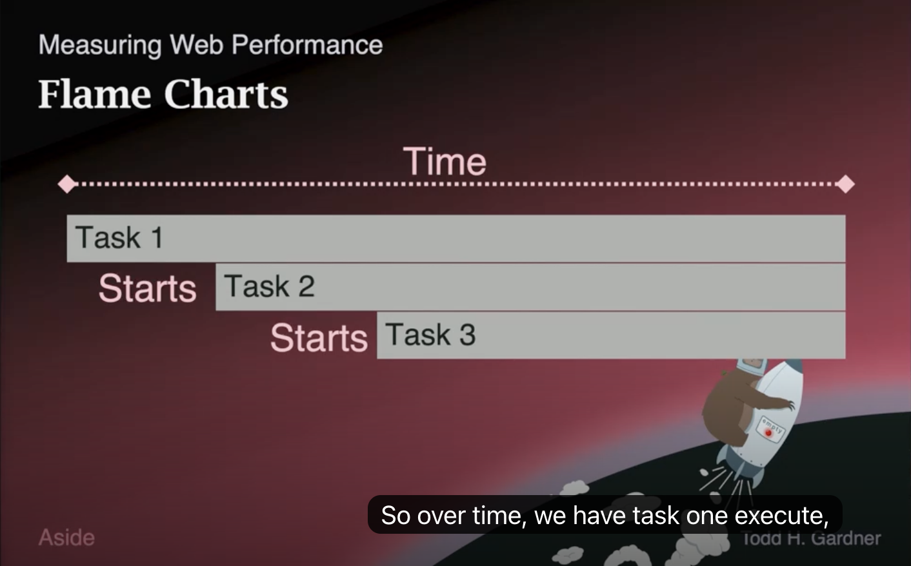
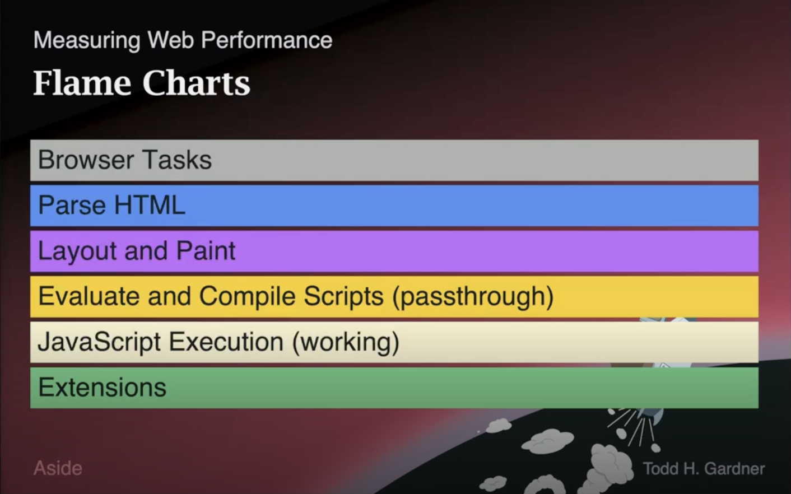
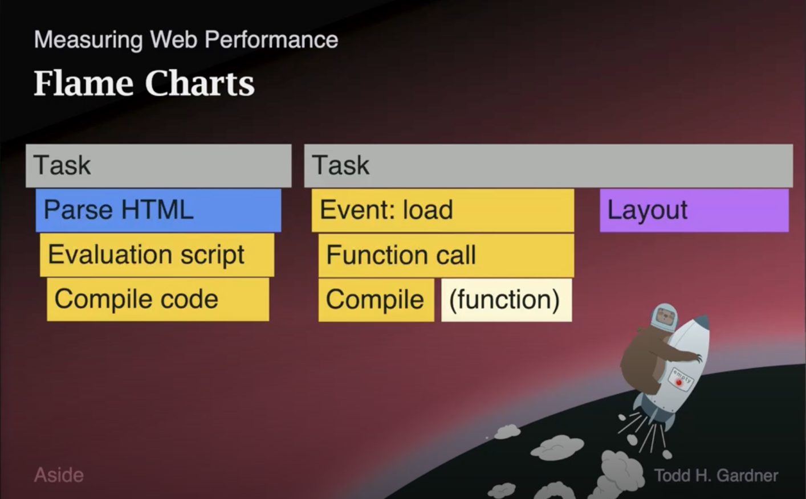

# Web Performance Fundamentals v2 - Flame Charts

## 1. 플레임 차트란 무엇인가 (What is a Flame Chart)

마지막 코어 웹 바이탈(Core Web Vital)인 <b>INP(Interaction to Next Paint)</b>를 이해하려면, 먼저 또 다른 종류의 차트인 <b>플레임 차트(Flame Chart)</b>를 이해해야 합니다. 플레임 차트는 <b>JavaScript의 성능을 이해하는 데 핵심적인 도구</b>이며, JavaScript 성능은 결국 마지막 코어 웹 바이탈에서 측정하려는 대상의 일부이기 때문입니다.

- 플레임 차트는 Chrome을 비롯한 여러 도구에서 확인할 수 있습니다.
- 보통 <b>워터폴(Waterfall)과 나란히 표시</b>되는데, 워터폴과는 <b>다른 차원의 정보</b>를 보여 주기 때문입니다.
- 측정 시간 단위는 보통 <b>밀리초(millisecond)와 마이크로초(microsecond)</b>입니다.
- 브라우저가 밀리초 단위의 시간 프레임에서 <b>실제로 수행하는 실행(execution)</b>을 측정합니다.

---

## 2. 플레임 차트 읽는 법 - 스택 구조

플레임 차트는 <b>막대(bar)가 쌓여 있는 형태(stacked bars)</b>로 구성됩니다.

- 어떤 <b>작업(task)</b>이 일어나야 하고, 그 작업이 또 다른 작업을 시작합니다.
- 시작된 다른 작업은 <b>아래쪽에 표시</b>되며, 그 작업이 다시 또 다른 작업들을 시작합니다.
- 그 결과 이렇게 <b>쌓인(stacked) 형태의 작업</b>으로 보이게 됩니다.

코드로 예를 들면, 다음과 같이 서로를 호출하는 세 개의 함수가 있다고 가정합니다.

```javascript
function task1() {
  task2();
}

function task2() {
  task3();
}

function task3() {
  // 무언가를 수행
}

task1();
```

`task1`을 실행하면 시간 흐름에 따라 다음 순서로 펼쳐져 표시됩니다.

1. `task1`이 실행됩니다.
2. `task1`이 `task2`를 시작합니다.
3. `task2`가 `task3`을 시작합니다.

막대의 <b>크기(길이)</b>는 부모 작업(parent task) 중에서 <b>자식 작업(child task)이 소비한 시간의 비율</b>을 나타냅니다.

| 작업 | 차지하는 범위 |
|---|---|
| `task1` | 전체 시간 (최상위) |
| `task2` | `task1`의 일부 |
| `task3` | `task2`의 일부 |



---

## 3. 색상 코드 (Color Coding)

웹에 관한 플레임 차트에서 막대는 <b>색상으로 작업의 종류를 구분</b>합니다.



| 색상 | 의미 |
|---|---|
| 회색(gray) | 최상위 레벨 브라우저 작업(top-level browser task) — 무언가가 발생함 |
| 파란색(blue) | HTML 파싱(parsing HTML) |
| 분홍색(pink) | 레이아웃(layout) 및 페인트(paint) 이벤트 |
| 진한 노란색(dark yellow) | <b>최상위 레벨 JavaScript</b> — 스크립트 평가·컴파일(evaluate/compile scripts)처럼 실제로는 큰 작업을 하지 않고 그냥 통과하는(pass through) 이벤트일 가능성이 높음 |
| 밝은 노란색(lighter yellow) | <b>실제 JavaScript 실행 시간</b> — 비용이 큰(expensive) 연산이 작업을 수행하는 경우 |
| 초록색(green) | 확장 프로그램(extensions) |

> 💡 초록색(확장 프로그램)은 확장 프로그램 개발을 하는 경우가 아니라면 대체로 무시해도 됩니다.

---

## 4. HTML 문서 예시로 보는 플레임 차트

`head`조차 없고 `body` 안에 `script` 태그 하나만 있는 작은 HTML 문서를 가정합니다. 이 스크립트는 `load` 이벤트를 기다린 다음 엘리먼트(element)를 생성하여 `body`에 삽입합니다.

```html
<body>
  <script>
    window.addEventListener('load', () => {
      var el = document.createElement('div');
      el.innerHTML = "<h1>Hey</h1>"
      document.body.appendChild(el);
    });
  </script>
</body>
```

이 문서가 플레임 차트에서 펼쳐지는 과정은 다음과 같습니다.

1. <b>첫 번째 작업 — HTML 파싱:</b> HTML 문서가 완전히 내려오면 브라우저가 "방금 받은 HTML을 파싱해야 한다"는 작업을 트리거합니다.
2. <b>스크립트 컴파일(최상위 레벨만):</b> 파싱 도중 `script` 태그를 만나면 그 스크립트를 컴파일합니다. 단, 이 시점에는 <b>JavaScript의 최상위 레벨만</b> 살펴봅니다. `window.addEventListener`가 있다는 것을 발견하지만, 콜백 함수 <b>내부 내용은 신경 쓰지 않습니다</b>. 그저 "나중에 떼어 내야 할(detach) 이벤트 리스너가 하나 있구나"라고만 인식합니다.
3. <b>두 번째 작업 — load 이벤트 발생:</b> `load` 이벤트가 준비되어 발생하면 등록된 함수를 호출합니다.
4. <b>함수 컴파일(지연 컴파일):</b> 이 함수는 <b>실제로 필요해지기 전까지 내용을 읽지 않았기 때문에</b>, 이때 비로소 컴파일됩니다.
5. <b>함수 실행 → 레이아웃 이벤트:</b> 함수가 실행되어 엘리먼트를 생성하고, 이로 인해 레이아웃(layout) 이벤트가 발생합니다.



위 설명은 단순화한 버전이며, 실제로 이 문서를 Chrome에서 로드해 보면 핵심 부분이 동일한 형태의 플레임으로 나타납니다.

<details><summary>지연 컴파일(lazy compilation)에 대한 부연 설명</summary>

브라우저는 스크립트를 만났을 때 함수 본문을 즉시 전부 컴파일하지 않습니다. 최상위 레벨을 먼저 훑어 "어떤 이벤트 리스너가 등록되는지" 정도만 파악하고, <b>실제로 그 함수가 호출되는 시점</b>이 되어서야 함수 내부를 컴파일합니다. 그래서 플레임 차트에서 컴파일 작업이 함수 호출 직전에 별도로 나타나는 것을 볼 수 있습니다.

</details>

---

## 5. 플레임 차트가 중요한 이유 - 메인 스레드 (Main Thread)

플레임 차트가 웹 성능에서 중요한 이유는 브라우저의 <b>메인 스레드(main thread)</b> 때문입니다.

- JavaScript를 포함한 <b>모든 것이 메인 스레드라는 단일 스레드(single thread)에서 동작</b>합니다.
- 메인 스레드는 브라우저가 다음 작업을 처리하기 위한 단일 작업 스레드입니다.
  - 사용자 이벤트 처리
  - 문서 레이아웃(layout)
  - 모든 것의 페인트(paint)
  - 여러분의 JavaScript 실행
- 이 모든 일이 <b>같은 스레드에서 일어나며, 그 스레드를 공유</b>해야 합니다.

따라서 <b>매우 느리고 많은 작업을 수행하는 JavaScript</b>를 작성하면, 다음과 같이 다른 일들이 일어나는 것을 막을 수 있습니다.

- 이벤트 발생(firing events)
- 문서 레이아웃(laying out the document)
- 페인트(painting)

즉, <b>사용자가 당연히 일어날 것이라 기대하는 일들이 일어나지 못하게 막을 수 있습니다.</b> 이것이 왜 중요한지는 다음 주제(INP)에서 이어서 다룹니다.

---

## Q&A

<details>
<summary>플레임 차트(Flame Chart)와 워터폴(Waterfall)의 차이는 무엇인가요? (Chrome 기준)</summary>

두 차트는 <b>같은 시간축을 공유하지만 측정하는 차원이 다릅니다.</b> 강의에서 "워터폴과 나란히 표시되지만 다른 차원의 정보를 보여 준다"고 한 부분이 이 의미입니다.

| 구분 | Waterfall | Flame Chart |
|---|---|---|
| Chrome 위치 | Network 패널 | Performance 패널 (Main 스레드 트랙) |
| 측정 대상 | 네트워크 리소스 로딩 (I/O) | 메인 스레드 CPU 실행 (호출 스택) |
| 한 막대의 의미 | 하나의 네트워크 요청 | 하나의 함수 호출/태스크 |
| 세로 방향 | 요청 목록 (병렬 요청) | 호출 스택 깊이 (부모→자식) |
| 시간 해상도 | ms ~ 초 | ms ~ µs (훨씬 미세) |
| 색상 의미 | 요청 단계(DNS/연결/TTFB/다운로드) | 작업 종류(파싱/레이아웃/JS) |

- <b>워터폴</b>은 <b>"무엇이 언제 네트워크로 다운로드되었나"</b>에 답합니다. 한 행이 하나의 요청이며, 각 막대는 Queueing → DNS → Connection → TTFB → Content Download 단계로 세분화됩니다.
- <b>플레임 차트</b>는 <b>"메인 스레드가 언제 무엇을 실행하느라 바빴나"</b>에 답합니다. 세로축은 호출 스택 깊이(부모 위, 자식 아래), 막대 길이는 소비 시간, 색상은 작업 종류를 나타냅니다.
- <b>함께 보는 이유</b>: 같은 가로 시간축을 공유하므로, 워터폴의 "리소스 도착 시점" → 플레임 차트의 "그 리소스를 받아 실행한 작업"으로 <b>네트워크 → 실행의 인과</b>를 추적할 수 있습니다.

</details>

<details>
<summary>HTML 문서 예시(섹션 4)에서 작업(Task)이 왜 두 개로 나뉘나요?</summary>

두 Task가 <b>서로 다른 시점에, 서로 다른 트리거로 발생한 별개의 이벤트 루프 turn</b>이기 때문입니다.

- <b>Task 1 (트리거: "받은 HTML을 파싱하라")</b>: `Parse HTML` → `Evaluate/Compile script`. 여기서 한 일은 사실상 `addEventListener('load', ...)`로 콜백을 <b>등록</b>한 것뿐입니다. 더 이상 동기적으로 할 일이 없으므로 작업이 종료되고 메인 스레드가 해제됩니다.
- <b>(gap)</b>: `load` 이벤트는 모든 리소스 로드 후에야 발생합니다. 아직 일어나지 않은 이벤트의 콜백을 Task 1 안에서 미리 실행할 수 없으므로 시간 간격이 생깁니다.
- <b>Task 2 (트리거: "load 이벤트 발생")</b>: `Event: load` → `Function call` → `Compile (function)` → 실행 → `Layout`.

핵심 원리: 메인 스레드는 <b>한 번에 하나의 작업만 끝까지(run-to-completion)</b> 처리하고 이벤트 루프로 돌아갑니다. 이벤트 핸들러 같은 비동기 콜백은 <b>등록한 작업에 끼어드는 것이 아니라, 이벤트가 실제 발생했을 때 별도의 미래 작업으로</b> 디스패치됩니다. 그래서 "등록"과 "실행"이 시간상 분리되어 두 개의 독립된 Task 블록으로 그려집니다.

> 작업이 짧은 여러 Task로 나뉘면 그 사이에 브라우저가 입력 처리·페인트를 할 틈이 생겨 반응성이 유지됩니다. 한 Task가 너무 길면 그동안 모든 것이 멈추며, 이것이 INP와 직결됩니다.

</details>
